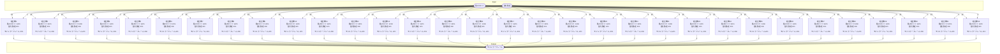

# 個別製造ライン設計書 モジュラーフレーム製造ライン

## 概要
以下の物品を生産する

- モジュラーフレーム

## Input
- 鉄のロッド 384/m
- 強化鉄板 96/m

## Output
- モジュラーフレーム 64/m

## 必要設備
- 組立機 32ケ
- ベルトコンベア類 適量

## 製造ライン

```mermaid
flowchart TD

subgraph Input
    鉄のロッド([鉄のロッド])
    強化鉄板([強化鉄板])
end

組立機1[
    組立機1
    鉄のロッド 12/m
    強化鉄板 3/m
    ↓
    モジュラーフレーム 2/m
]

組立機2[
    組立機2
    鉄のロッド 12/m
    強化鉄板 3/m
    ↓
    モジュラーフレーム 2/m
]

組立機3[
    組立機3
    鉄のロッド 12/m
    強化鉄板 3/m
    ↓
    モジュラーフレーム 2/m
]

組立機4[
    組立機4
    鉄のロッド 12/m
    強化鉄板 3/m
    ↓
    モジュラーフレーム 2/m
]

組立機5[
    組立機5
    鉄のロッド 12/m
    強化鉄板 3/m
    ↓
    モジュラーフレーム 2/m
]

組立機6[
    組立機6
    鉄のロッド 12/m
    強化鉄板 3/m
    ↓
    モジュラーフレーム 2/m
]

組立機7[
    組立機7
    鉄のロッド 12/m
    強化鉄板 3/m
    ↓
    モジュラーフレーム 2/m
]

組立機8[
    組立機8
    鉄のロッド 12/m
    強化鉄板 3/m
    ↓
    モジュラーフレーム 2/m
]

組立機9[
    組立機9
    鉄のロッド 12/m
    強化鉄板 3/m
    ↓
    モジュラーフレーム 2/m
]

組立機10[
    組立機10
    鉄のロッド 12/m
    強化鉄板 3/m
    ↓
    モジュラーフレーム 2/m
]

組立機11[
    組立機11
    鉄のロッド 12/m
    強化鉄板 3/m
    ↓
    モジュラーフレーム 2/m
]

組立機12[
    組立機12
    鉄のロッド 12/m
    強化鉄板 3/m
    ↓
    モジュラーフレーム 2/m
]

組立機13[
    組立機13
    鉄のロッド 12/m
    強化鉄板 3/m
    ↓
    モジュラーフレーム 2/m
]

組立機14[
    組立機14
    鉄のロッド 12/m
    強化鉄板 3/m
    ↓
    モジュラーフレーム 2/m
]

組立機15[
    組立機15
    鉄のロッド 12/m
    強化鉄板 3/m
    ↓
    モジュラーフレーム 2/m
]

組立機16[
    組立機16
    鉄のロッド 12/m
    強化鉄板 3/m
    ↓
    モジュラーフレーム 2/m
]

組立機17[
    組立機17
    鉄のロッド 12/m
    強化鉄板 3/m
    ↓
    モジュラーフレーム 2/m
]

組立機18[
    組立機18
    鉄のロッド 12/m
    強化鉄板 3/m
    ↓
    モジュラーフレーム 2/m
]

組立機19[
    組立機19
    鉄のロッド 12/m
    強化鉄板 3/m
    ↓
    モジュラーフレーム 2/m
]

組立機20[
    組立機20
    鉄のロッド 12/m
    強化鉄板 3/m
    ↓
    モジュラーフレーム 2/m
]

組立機21[
    組立機21
    鉄のロッド 12/m
    強化鉄板 3/m
    ↓
    モジュラーフレーム 2/m
]

組立機22[
    組立機22
    鉄のロッド 12/m
    強化鉄板 3/m
    ↓
    モジュラーフレーム 2/m
]

組立機23[
    組立機23
    鉄のロッド 12/m
    強化鉄板 3/m
    ↓
    モジュラーフレーム 2/m
]

組立機24[
    組立機24
    鉄のロッド 12/m
    強化鉄板 3/m
    ↓
    モジュラーフレーム 2/m
]

組立機25[
    組立機25
    鉄のロッド 12/m
    強化鉄板 3/m
    ↓
    モジュラーフレーム 2/m
]

組立機26[
    組立機26
    鉄のロッド 12/m
    強化鉄板 3/m
    ↓
    モジュラーフレーム 2/m
]

組立機27[
    組立機27
    鉄のロッド 12/m
    強化鉄板 3/m
    ↓
    モジュラーフレーム 2/m
]

組立機28[
    組立機28
    鉄のロッド 12/m
    強化鉄板 3/m
    ↓
    モジュラーフレーム 2/m
]

組立機29[
    組立機29
    鉄のロッド 12/m
    強化鉄板 3/m
    ↓
    モジュラーフレーム 2/m
]

組立機30[
    組立機30
    鉄のロッド 12/m
    強化鉄板 3/m
    ↓
    モジュラーフレーム 2/m
]

組立機31[
    組立機31
    鉄のロッド 12/m
    強化鉄板 3/m
    ↓
    モジュラーフレーム 2/m
]

組立機32[
    組立機32
    鉄のロッド 12/m
    強化鉄板 3/m
    ↓
    モジュラーフレーム 2/m
]

subgraph Output
    モジュラーフレーム([モジュラーフレーム])
end

鉄のロッド-->|12|組立機1
強化鉄板-->|3|組立機1
組立機1-->|2|モジュラーフレーム
鉄のロッド-->|12|組立機2
強化鉄板-->|3|組立機2
組立機2-->|2|モジュラーフレーム
鉄のロッド-->|12|組立機3
強化鉄板-->|3|組立機3
組立機3-->|2|モジュラーフレーム
鉄のロッド-->|12|組立機4
強化鉄板-->|3|組立機4
組立機4-->|2|モジュラーフレーム
鉄のロッド-->|12|組立機5
強化鉄板-->|3|組立機5
組立機5-->|2|モジュラーフレーム
鉄のロッド-->|12|組立機6
強化鉄板-->|3|組立機6
組立機6-->|2|モジュラーフレーム
鉄のロッド-->|12|組立機7
強化鉄板-->|3|組立機7
組立機7-->|2|モジュラーフレーム
鉄のロッド-->|12|組立機8
強化鉄板-->|3|組立機8
組立機8-->|2|モジュラーフレーム
鉄のロッド-->|12|組立機9
強化鉄板-->|3|組立機9
組立機9-->|2|モジュラーフレーム
鉄のロッド-->|12|組立機10
強化鉄板-->|3|組立機10
組立機10-->|2|モジュラーフレーム
鉄のロッド-->|12|組立機11
強化鉄板-->|3|組立機11
組立機11-->|2|モジュラーフレーム
鉄のロッド-->|12|組立機12
強化鉄板-->|3|組立機12
組立機12-->|2|モジュラーフレーム
鉄のロッド-->|12|組立機13
強化鉄板-->|3|組立機13
組立機13-->|2|モジュラーフレーム
鉄のロッド-->|12|組立機14
強化鉄板-->|3|組立機14
組立機14-->|2|モジュラーフレーム
鉄のロッド-->|12|組立機15
強化鉄板-->|3|組立機15
組立機15-->|2|モジュラーフレーム
鉄のロッド-->|12|組立機16
強化鉄板-->|3|組立機16
組立機16-->|2|モジュラーフレーム
鉄のロッド-->|12|組立機17
強化鉄板-->|3|組立機17
組立機17-->|2|モジュラーフレーム
鉄のロッド-->|12|組立機18
強化鉄板-->|3|組立機18
組立機18-->|2|モジュラーフレーム
鉄のロッド-->|12|組立機19
強化鉄板-->|3|組立機19
組立機19-->|2|モジュラーフレーム
鉄のロッド-->|12|組立機20
強化鉄板-->|3|組立機20
組立機20-->|2|モジュラーフレーム
鉄のロッド-->|12|組立機21
強化鉄板-->|3|組立機21
組立機21-->|2|モジュラーフレーム
鉄のロッド-->|12|組立機22
強化鉄板-->|3|組立機22
組立機22-->|2|モジュラーフレーム
鉄のロッド-->|12|組立機23
強化鉄板-->|3|組立機23
組立機23-->|2|モジュラーフレーム
鉄のロッド-->|12|組立機24
強化鉄板-->|3|組立機24
組立機24-->|2|モジュラーフレーム
鉄のロッド-->|12|組立機25
強化鉄板-->|3|組立機25
組立機25-->|2|モジュラーフレーム
鉄のロッド-->|12|組立機26
強化鉄板-->|3|組立機26
組立機26-->|2|モジュラーフレーム
鉄のロッド-->|12|組立機27
強化鉄板-->|3|組立機27
組立機27-->|2|モジュラーフレーム
鉄のロッド-->|12|組立機28
強化鉄板-->|3|組立機28
組立機28-->|2|モジュラーフレーム
鉄のロッド-->|12|組立機29
強化鉄板-->|3|組立機29
組立機29-->|2|モジュラーフレーム
鉄のロッド-->|12|組立機30
強化鉄板-->|3|組立機30
組立機30-->|2|モジュラーフレーム
鉄のロッド-->|12|組立機31
強化鉄板-->|3|組立機31
組立機31-->|2|モジュラーフレーム
鉄のロッド-->|12|組立機32
強化鉄板-->|3|組立機32
組立機32-->|2|モジュラーフレーム
```

## 情報
書類テンプレートバージョン : 1.5.0
