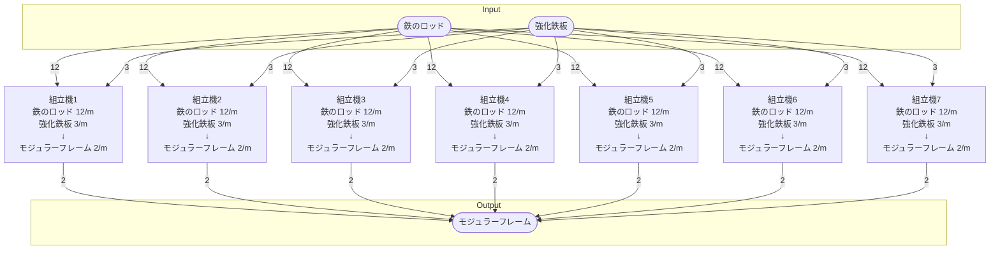

# 個別製造ライン設計書 モジュラーフレーム製造ライン

## 概要
以下の物品を生産する

- モジュラーフレーム

## Input
- 鉄のロッド 84/m
- 強化鉄板 21/m

## Output
- モジュラーフレーム 14/m

## 必要設備
- 組立機 7ケ
- ベルトコンベア類 適量

## 製造ライン

```mermaid
flowchart TD

subgraph Input
    鉄のロッド([鉄のロッド])
    強化鉄板([強化鉄板])
end

組立機1[
    組立機1
    鉄のロッド 12/m
    強化鉄板 3/m
    ↓
    モジュラーフレーム 2/m
]

組立機2[
    組立機2
    鉄のロッド 12/m
    強化鉄板 3/m
    ↓
    モジュラーフレーム 2/m
]

組立機3[
    組立機3
    鉄のロッド 12/m
    強化鉄板 3/m
    ↓
    モジュラーフレーム 2/m
]

組立機4[
    組立機4
    鉄のロッド 12/m
    強化鉄板 3/m
    ↓
    モジュラーフレーム 2/m
]

組立機5[
    組立機5
    鉄のロッド 12/m
    強化鉄板 3/m
    ↓
    モジュラーフレーム 2/m
]

組立機6[
    組立機6
    鉄のロッド 12/m
    強化鉄板 3/m
    ↓
    モジュラーフレーム 2/m
]

組立機7[
    組立機7
    鉄のロッド 12/m
    強化鉄板 3/m
    ↓
    モジュラーフレーム 2/m
]

subgraph Output
    モジュラーフレーム([モジュラーフレーム])
end

鉄のロッド-->|12|組立機1
強化鉄板-->|3|組立機1
組立機1-->|2|モジュラーフレーム
鉄のロッド-->|12|組立機2
強化鉄板-->|3|組立機2
組立機2-->|2|モジュラーフレーム
鉄のロッド-->|12|組立機3
強化鉄板-->|3|組立機3
組立機3-->|2|モジュラーフレーム
鉄のロッド-->|12|組立機4
強化鉄板-->|3|組立機4
組立機4-->|2|モジュラーフレーム
鉄のロッド-->|12|組立機5
強化鉄板-->|3|組立機5
組立機5-->|2|モジュラーフレーム
鉄のロッド-->|12|組立機6
強化鉄板-->|3|組立機6
組立機6-->|2|モジュラーフレーム
鉄のロッド-->|12|組立機7
強化鉄板-->|3|組立機7
組立機7-->|2|モジュラーフレーム
```

## 情報
書類テンプレートバージョン : 1.5.0
