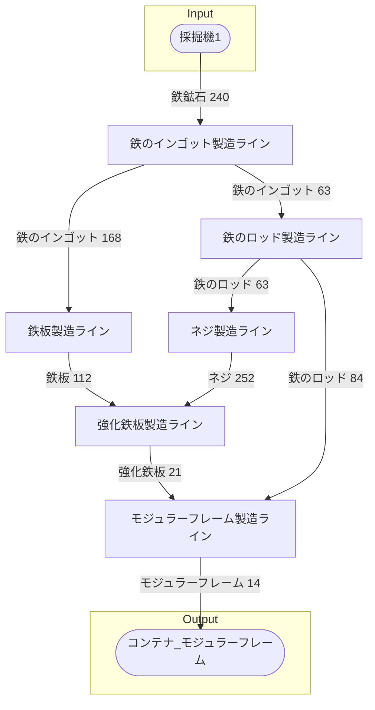

# モジュラーフレーム第01工場 全体製造ライン設計書

## 使用レシピ

### モジュラーフレーム
|Input|Output|
|---|---|
|鉄のロッド 12/m|モジュラーフレーム 2/m|
|強化鉄板 3/m||

### 強化鉄板
|Input|Output|
|---|---|
|鉄板 30/m|強化鉄板 5/m|
|ネジ 60/m||

### ネジ
|Input|Output|
|---|---|
|鉄のロッド 10/m|ネジ 40/m|

### 鉄のロッド
|Input|Output|
|---|---|
|鉄のインゴット 15/m|鉄のロッド 15/m|

### 鉄板
|Input|Output|
|---|---|
|鉄のインゴット 30/m|鉄板 20/m|

### 鉄のインゴット
|Input|Output|
|---|---|
|鉄鉱石 30/m|鉄のインゴット 30/m|

## 必要製造ライン
### モジュラーフレーム
|レシピ名|数|Input計|Output計|
|---|---|---|---|
|鉄のインゴット|7|鉄鉱石 30/m|鉄のインゴット 30/m|

### 強化鉄板
|レシピ名|数|Input計|Output計|
|---|---|---|---|
|鉄のインゴット|7|鉄鉱石 30/m|鉄のインゴット 30/m|

### ネジ
|レシピ名|数|Input計|Output計|
|---|---|---|---|
|鉄のインゴット|7|鉄鉱石 30/m|鉄のインゴット 30/m|

### 鉄のロッド
|レシピ名|数|Input計|Output計|
|---|---|---|---|
|鉄のインゴット|7|鉄鉱石 30/m|鉄のインゴット 30/m|

### 鉄板製造ライン
|レシピ名|数|Input計|Output計|
|---|---|---|---|
|鉄板|7|鉄のインゴット 30/m|鉄板 20/m|

### 鉄のインゴット製造ライン
|レシピ名|数|Input計|Output計|
|---|---|---|---|
|鉄のインゴット|7|鉄鉱石 30/m|鉄のインゴット 30/m|

## 製造ラインフローチャート

## 情報
書類テンプレートバージョン : 1.7.0
