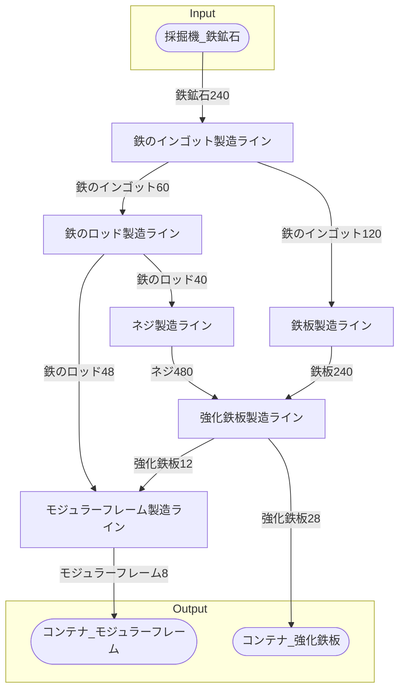

# モジュラーフレーム第01工場 全体製造ライン設計書

## 使用レシピ

### モジュラーフレーム
|I/O|物品名|要求数|
|---|---|---|
|input|鉄のロッド|12|
|input|強化鉄板|3|
|---|---|---|
|output|モジュラーフレーム|2|
### 強化鉄板
|I/O|物品名|要求数|
|---|---|---|
|input|鉄板|30|
|input|ネジ|60|
|---|---|---|
|output|強化鉄板|5|
### 鉄板
|I/O|物品名|要求数|
|---|---|---|
|input|鉄のインゴット|30|
|---|---|---|
|output|鉄板|20|
### ネジ
|I/O|物品名|要求数|
|---|---|---|
|input|鉄のロッド|10|
|---|---|---|
|output|ネジ|40|
### 鉄のロッド
|I/O|物品名|要求数|
|---|---|---|
|input|鉄のインゴット|15|
|---|---|---|
|output|鉄のロッド|15|
### 鉄のインゴット
|I/O|物品名|要求数|
|---|---|---|
|input|鉄鉱石|30|
|---|---|---|
|output|鉄のインゴット|30|

## 必要製造ライン
### モジュラーフレーム製造ライン

レシピ名 : モジュラーフレーム  
レシピ数 : 4

|I/O|物品名|要求数|
|---|---|---|
|input|鉄のロッド|48|
|input|強化鉄板|12|
|---|---|---|
|output|モジュラーフレーム|8|

### 強化鉄板製造ライン

レシピ名 : 強化鉄板  
レシピ数 : 8

|I/O|物品名|要求数|
|---|---|---|
|input|鉄板|240|
|input|ネジ|480|
|---|---|---|
|output|強化鉄板|40|

### 鉄板製造ライン

レシピ名 : 鉄板  
レシピ数 : 4

|I/O|物品名|要求数|
|---|---|---|
|input|鉄のインゴット|120|
|---|---|---|
|output|鉄板|80|

### ネジ製造ライン

レシピ名 : ネジ  
レシピ数 : 4

|I/O|物品名|要求数|
|---|---|---|
|input|鉄のロッド|40|
|---|---|---|
|output|ネジ|160|

### 鉄のロッド製造ライン

レシピ名 : 鉄のロッド  
レシピ数 : 8

|I/O|物品名|要求数|
|---|---|---|
|input|鉄のインゴット|120|
|---|---|---|
|output|鉄のロッド|120|

### 鉄のインゴット製造ライン

レシピ名 : 鉄のインゴット  
レシピ数 : 8

|I/O|物品名|要求数|
|---|---|---|
|input|鉄鉱石|240|
|---|---|---|
|output|鉄のインゴット|240|

## 製造ラインフローチャート

## 情報
書類テンプレートバージョン : 1.7.0
