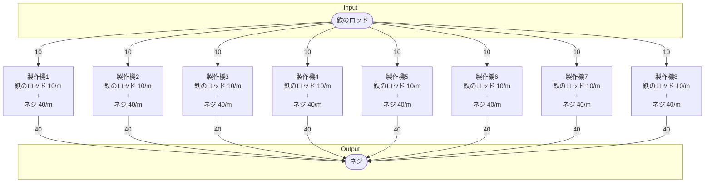

# 個別製造ライン設計書 ネジ製造ライン

## 概要
ネジを製造するライン

## Input
- 鉄のロッド 80/m

## Output
- ネジ 320/m

## 必要設備
- 製作機 8ケ
- ベルトコンベア類 適量

## 製造ライン

```mermaid
flowchart TD

subgraph Input
    鉄のロッド([鉄のロッド])
end

製作機1[
    製作機1
    鉄のロッド 10/m
    ↓
    ネジ 40/m
]

製作機2[
    製作機2
    鉄のロッド 10/m
    ↓
    ネジ 40/m
]

製作機3[
    製作機3
    鉄のロッド 10/m
    ↓
    ネジ 40/m
]

製作機4[
    製作機4
    鉄のロッド 10/m
    ↓
    ネジ 40/m
]

製作機5[
    製作機5
    鉄のロッド 10/m
    ↓
    ネジ 40/m
]

製作機6[
    製作機6
    鉄のロッド 10/m
    ↓
    ネジ 40/m
]

製作機7[
    製作機7
    鉄のロッド 10/m
    ↓
    ネジ 40/m
]

製作機8[
    製作機8
    鉄のロッド 10/m
    ↓
    ネジ 40/m
]

subgraph Output
    ネジ([ネジ])
end

鉄のロッド-->|10|製作機1
製作機1-->|40|ネジ
鉄のロッド-->|10|製作機2
製作機2-->|40|ネジ
鉄のロッド-->|10|製作機3
製作機3-->|40|ネジ
鉄のロッド-->|10|製作機4
製作機4-->|40|ネジ
鉄のロッド-->|10|製作機5
製作機5-->|40|ネジ
鉄のロッド-->|10|製作機6
製作機6-->|40|ネジ
鉄のロッド-->|10|製作機7
製作機7-->|40|ネジ
鉄のロッド-->|10|製作機8
製作機8-->|40|ネジ
```

## 情報
書類テンプレートバージョン : 1.5.0
