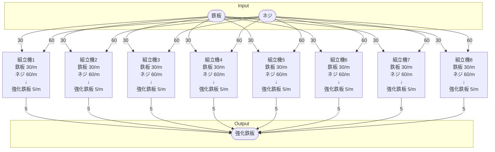

# 個別製造ライン設計書 強化鉄板製造ライン

## 概要
強化鉄板を製造するライン

## Input
- 鉄板 240/m
- ネジ 480/m

## Output
- 強化鉄板 40/m

## 必要設備
- 組立機 8ケ
- ベルトコンベア類 適量

## 製造ライン

```mermaid
flowchart TD

subgraph Input
    鉄板([鉄板])
    ネジ([ネジ])
end

組立機1[
    組立機1
    鉄板 30/m
    ネジ 60/m
    ↓
    強化鉄板 5/m
]

組立機2[
    組立機2
    鉄板 30/m
    ネジ 60/m
    ↓
    強化鉄板 5/m
]

組立機3[
    組立機3
    鉄板 30/m
    ネジ 60/m
    ↓
    強化鉄板 5/m
]

組立機4[
    組立機4
    鉄板 30/m
    ネジ 60/m
    ↓
    強化鉄板 5/m
]

組立機5[
    組立機5
    鉄板 30/m
    ネジ 60/m
    ↓
    強化鉄板 5/m
]

組立機6[
    組立機6
    鉄板 30/m
    ネジ 60/m
    ↓
    強化鉄板 5/m
]

組立機7[
    組立機7
    鉄板 30/m
    ネジ 60/m
    ↓
    強化鉄板 5/m
]

組立機8[
    組立機8
    鉄板 30/m
    ネジ 60/m
    ↓
    強化鉄板 5/m
]

subgraph Output
    強化鉄板([強化鉄板])
end

鉄板-->|30|組立機1
ネジ-->|60|組立機1
組立機1-->|5|強化鉄板
鉄板-->|30|組立機2
ネジ-->|60|組立機2
組立機2-->|5|強化鉄板
鉄板-->|30|組立機3
ネジ-->|60|組立機3
組立機3-->|5|強化鉄板
鉄板-->|30|組立機4
ネジ-->|60|組立機4
組立機4-->|5|強化鉄板
鉄板-->|30|組立機5
ネジ-->|60|組立機5
組立機5-->|5|強化鉄板
鉄板-->|30|組立機6
ネジ-->|60|組立機6
組立機6-->|5|強化鉄板
鉄板-->|30|組立機7
ネジ-->|60|組立機7
組立機7-->|5|強化鉄板
鉄板-->|30|組立機8
ネジ-->|60|組立機8
組立機8-->|5|強化鉄板
```

## 情報
書類テンプレートバージョン : 1.5.0
