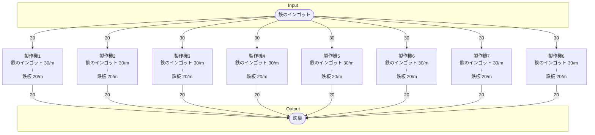

# 個別製造ライン設計書 鉄板製造ライン

## 概要
鉄板を製造するライン

## Input
- 鉄のインゴット 240/m

## Output
- 鉄板 160/m

## 必要設備
- 製作機 8ケ
- ベルトコンベア類 適量

## 製造ライン

```mermaid
flowchart TD

subgraph Input
    鉄のインゴット([鉄のインゴット])
end

製作機1[
    製作機1
    鉄のインゴット 30/m
    ↓
    鉄板 20/m
]

製作機2[
    製作機2
    鉄のインゴット 30/m
    ↓
    鉄板 20/m
]

製作機3[
    製作機3
    鉄のインゴット 30/m
    ↓
    鉄板 20/m
]

製作機4[
    製作機4
    鉄のインゴット 30/m
    ↓
    鉄板 20/m
]

製作機5[
    製作機5
    鉄のインゴット 30/m
    ↓
    鉄板 20/m
]

製作機6[
    製作機6
    鉄のインゴット 30/m
    ↓
    鉄板 20/m
]

製作機7[
    製作機7
    鉄のインゴット 30/m
    ↓
    鉄板 20/m
]

製作機8[
    製作機8
    鉄のインゴット 30/m
    ↓
    鉄板 20/m
]

subgraph Output
    鉄板([鉄板])
end

鉄のインゴット-->|30|製作機1
製作機1-->|20|鉄板
鉄のインゴット-->|30|製作機2
製作機2-->|20|鉄板
鉄のインゴット-->|30|製作機3
製作機3-->|20|鉄板
鉄のインゴット-->|30|製作機4
製作機4-->|20|鉄板
鉄のインゴット-->|30|製作機5
製作機5-->|20|鉄板
鉄のインゴット-->|30|製作機6
製作機6-->|20|鉄板
鉄のインゴット-->|30|製作機7
製作機7-->|20|鉄板
鉄のインゴット-->|30|製作機8
製作機8-->|20|鉄板
```

## 情報
書類テンプレートバージョン : 1.5.0
