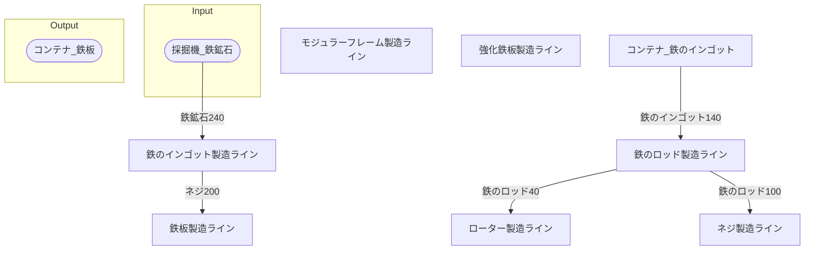

# モジュラーフレーム第01工場 全体製造ライン設計書

## 使用レシピ

### モジュラーフレーム
|I/O|物品名|要求数|
|---|---|---|
|input|鉄のロッド|12|
|input|強化鉄板|3|
|---|---|---|
|output|モジュラーフレーム|2|
### 強化鉄板
|I/O|物品名|要求数|
|---|---|---|
|input|鉄板|30|
|input|ネジ|60|
|---|---|---|
|output|強化鉄板|5|
### ネジ
|I/O|物品名|要求数|
|---|---|---|
|input|鉄のロッド|10|
|---|---|---|
|output|ネジ|40|
### 鉄のロッド
|I/O|物品名|要求数|
|---|---|---|
|input|鉄のインゴット|15|
|---|---|---|
|output|鉄のロッド|15|
### 鉄板
|I/O|物品名|要求数|
|---|---|---|
|input|鉄のインゴット|30|
|---|---|---|
|output|鉄板|20|
### 鉄のインゴット
|I/O|物品名|要求数|
|---|---|---|
|input|鉄鉱石|30|
|---|---|---|
|output|鉄のインゴット|30|

## 必要製造ライン
### モジュラーフレーム製造ライン

レシピ名 : モジュラーフレーム  
レシピ数 : 7

|I/O|物品名|要求数|
|---|---|---|
|input|鉄のロッド|84|
|input|強化鉄板|21|
|---|---|---|
|output|モジュラーフレーム|14|

### 強化鉄板製造ライン

レシピ名 : 強化鉄板  
レシピ数 : 7

|I/O|物品名|要求数|
|---|---|---|
|input|鉄板|210|
|input|ネジ|420|
|---|---|---|
|output|強化鉄板|35|

### ネジ製造ライン

レシピ名 : ネジ  
レシピ数 : 7

|I/O|物品名|要求数|
|---|---|---|
|input|鉄のロッド|70|
|---|---|---|
|output|ネジ|280|

### 鉄のロッド製造ライン

レシピ名 : 鉄のロッド  
レシピ数 : 7

|I/O|物品名|要求数|
|---|---|---|
|input|鉄のインゴット|105|
|---|---|---|
|output|鉄のロッド|105|

### 鉄板製造ライン

レシピ名 : 鉄板  
レシピ数 : 7

|I/O|物品名|要求数|
|---|---|---|
|input|鉄のインゴット|210|
|---|---|---|
|output|鉄板|140|

### 鉄のインゴット製造ライン

レシピ名 : 鉄のインゴット  
レシピ数 : 7

|I/O|物品名|要求数|
|---|---|---|
|input|鉄鉱石|210|
|---|---|---|
|output|鉄のインゴット|210|

## 製造ラインフローチャート

## 情報
書類テンプレートバージョン : 1.7.0
