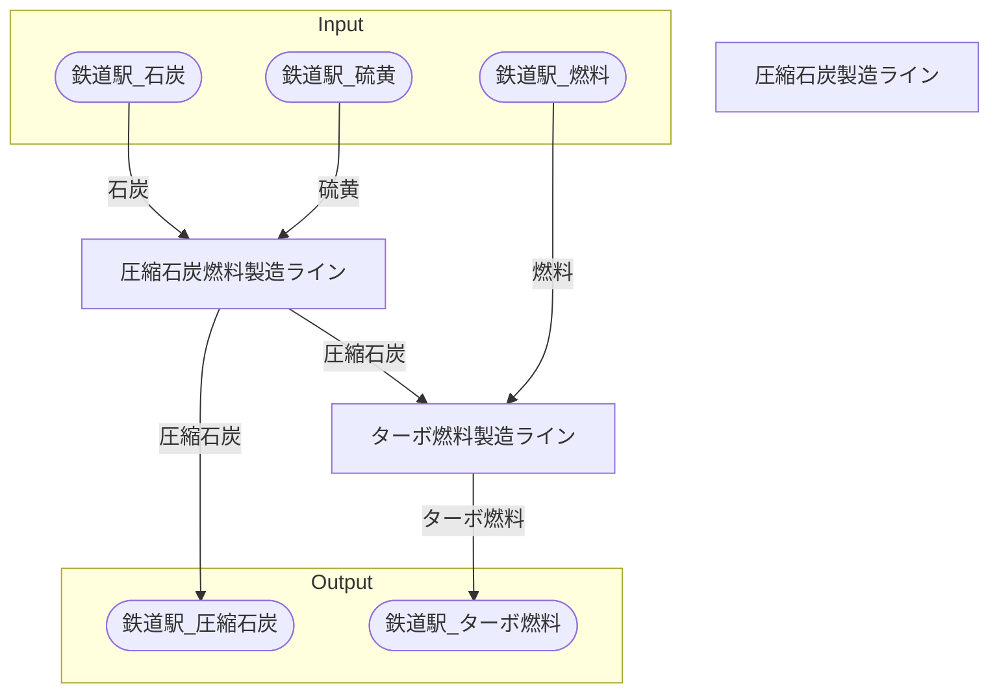

# リヤドターボ燃料工場 全体製造ライン設計書

## 使用レシピ
### 圧縮石炭
|I/O|物品名|要求数|
|---|---|---|
|input|石炭|25|
|input|硫黄|25|
|---|---|---|
|output|圧縮石炭|25|
### ターボ燃料
|I/O|物品名|要求数|
|---|---|---|
|input|燃料|22.5|
|input|圧縮石炭|15|
|---|---|---|
|output|ターボ燃料|18.75|

## 必要製造ライン
### 圧縮石炭製造ライン

レシピ名 : 圧縮石炭  
レシピ数 : 32

|I/O|物品名|要求数|
|---|---|---|
|input|石炭|800|
|input|硫黄|800|
|---|---|---|
|output|圧縮石炭|800|

### ターボ燃料製造ライン

レシピ名 : ターボ燃料  
レシピ数 : 32

|I/O|物品名|要求数|
|---|---|---|
|input|燃料|720.0|
|input|圧縮石炭|480|
|---|---|---|
|output|ターボ燃料|600.0|

## 製造ラインフローチャート

## 情報
書類テンプレートバージョン : 1.7.0
