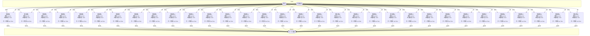

# 個別製造ライン設計書 ターボ燃料製造ライン

## 概要
以下の物品を生産する

- ターボ燃料

## Input
- 燃料 720.0/m
- 圧縮石炭 480/m

## Output
- ターボ燃料 600.0/m

## 必要設備
- 精製機 32ケ
- ベルトコンベア類 適量

## 製造ライン

```mermaid
flowchart TD

subgraph Input
    燃料([燃料])
    圧縮石炭([圧縮石炭])
end

精製機1[
    精製機1
    燃料 22.5/m
    圧縮石炭 15/m
    ↓
    ターボ燃料 18.75/m
]

精製機2[
    精製機2
    燃料 22.5/m
    圧縮石炭 15/m
    ↓
    ターボ燃料 18.75/m
]

精製機3[
    精製機3
    燃料 22.5/m
    圧縮石炭 15/m
    ↓
    ターボ燃料 18.75/m
]

精製機4[
    精製機4
    燃料 22.5/m
    圧縮石炭 15/m
    ↓
    ターボ燃料 18.75/m
]

精製機5[
    精製機5
    燃料 22.5/m
    圧縮石炭 15/m
    ↓
    ターボ燃料 18.75/m
]

精製機6[
    精製機6
    燃料 22.5/m
    圧縮石炭 15/m
    ↓
    ターボ燃料 18.75/m
]

精製機7[
    精製機7
    燃料 22.5/m
    圧縮石炭 15/m
    ↓
    ターボ燃料 18.75/m
]

精製機8[
    精製機8
    燃料 22.5/m
    圧縮石炭 15/m
    ↓
    ターボ燃料 18.75/m
]

精製機9[
    精製機9
    燃料 22.5/m
    圧縮石炭 15/m
    ↓
    ターボ燃料 18.75/m
]

精製機10[
    精製機10
    燃料 22.5/m
    圧縮石炭 15/m
    ↓
    ターボ燃料 18.75/m
]

精製機11[
    精製機11
    燃料 22.5/m
    圧縮石炭 15/m
    ↓
    ターボ燃料 18.75/m
]

精製機12[
    精製機12
    燃料 22.5/m
    圧縮石炭 15/m
    ↓
    ターボ燃料 18.75/m
]

精製機13[
    精製機13
    燃料 22.5/m
    圧縮石炭 15/m
    ↓
    ターボ燃料 18.75/m
]

精製機14[
    精製機14
    燃料 22.5/m
    圧縮石炭 15/m
    ↓
    ターボ燃料 18.75/m
]

精製機15[
    精製機15
    燃料 22.5/m
    圧縮石炭 15/m
    ↓
    ターボ燃料 18.75/m
]

精製機16[
    精製機16
    燃料 22.5/m
    圧縮石炭 15/m
    ↓
    ターボ燃料 18.75/m
]

精製機17[
    精製機17
    燃料 22.5/m
    圧縮石炭 15/m
    ↓
    ターボ燃料 18.75/m
]

精製機18[
    精製機18
    燃料 22.5/m
    圧縮石炭 15/m
    ↓
    ターボ燃料 18.75/m
]

精製機19[
    精製機19
    燃料 22.5/m
    圧縮石炭 15/m
    ↓
    ターボ燃料 18.75/m
]

精製機20[
    精製機20
    燃料 22.5/m
    圧縮石炭 15/m
    ↓
    ターボ燃料 18.75/m
]

精製機21[
    精製機21
    燃料 22.5/m
    圧縮石炭 15/m
    ↓
    ターボ燃料 18.75/m
]

精製機22[
    精製機22
    燃料 22.5/m
    圧縮石炭 15/m
    ↓
    ターボ燃料 18.75/m
]

精製機23[
    精製機23
    燃料 22.5/m
    圧縮石炭 15/m
    ↓
    ターボ燃料 18.75/m
]

精製機24[
    精製機24
    燃料 22.5/m
    圧縮石炭 15/m
    ↓
    ターボ燃料 18.75/m
]

精製機25[
    精製機25
    燃料 22.5/m
    圧縮石炭 15/m
    ↓
    ターボ燃料 18.75/m
]

精製機26[
    精製機26
    燃料 22.5/m
    圧縮石炭 15/m
    ↓
    ターボ燃料 18.75/m
]

精製機27[
    精製機27
    燃料 22.5/m
    圧縮石炭 15/m
    ↓
    ターボ燃料 18.75/m
]

精製機28[
    精製機28
    燃料 22.5/m
    圧縮石炭 15/m
    ↓
    ターボ燃料 18.75/m
]

精製機29[
    精製機29
    燃料 22.5/m
    圧縮石炭 15/m
    ↓
    ターボ燃料 18.75/m
]

精製機30[
    精製機30
    燃料 22.5/m
    圧縮石炭 15/m
    ↓
    ターボ燃料 18.75/m
]

精製機31[
    精製機31
    燃料 22.5/m
    圧縮石炭 15/m
    ↓
    ターボ燃料 18.75/m
]

精製機32[
    精製機32
    燃料 22.5/m
    圧縮石炭 15/m
    ↓
    ターボ燃料 18.75/m
]

subgraph Output
    ターボ燃料([ターボ燃料])
end

燃料-->|22.5|精製機1
圧縮石炭-->|15|精製機1
精製機1-->|18.75|ターボ燃料
燃料-->|22.5|精製機2
圧縮石炭-->|15|精製機2
精製機2-->|18.75|ターボ燃料
燃料-->|22.5|精製機3
圧縮石炭-->|15|精製機3
精製機3-->|18.75|ターボ燃料
燃料-->|22.5|精製機4
圧縮石炭-->|15|精製機4
精製機4-->|18.75|ターボ燃料
燃料-->|22.5|精製機5
圧縮石炭-->|15|精製機5
精製機5-->|18.75|ターボ燃料
燃料-->|22.5|精製機6
圧縮石炭-->|15|精製機6
精製機6-->|18.75|ターボ燃料
燃料-->|22.5|精製機7
圧縮石炭-->|15|精製機7
精製機7-->|18.75|ターボ燃料
燃料-->|22.5|精製機8
圧縮石炭-->|15|精製機8
精製機8-->|18.75|ターボ燃料
燃料-->|22.5|精製機9
圧縮石炭-->|15|精製機9
精製機9-->|18.75|ターボ燃料
燃料-->|22.5|精製機10
圧縮石炭-->|15|精製機10
精製機10-->|18.75|ターボ燃料
燃料-->|22.5|精製機11
圧縮石炭-->|15|精製機11
精製機11-->|18.75|ターボ燃料
燃料-->|22.5|精製機12
圧縮石炭-->|15|精製機12
精製機12-->|18.75|ターボ燃料
燃料-->|22.5|精製機13
圧縮石炭-->|15|精製機13
精製機13-->|18.75|ターボ燃料
燃料-->|22.5|精製機14
圧縮石炭-->|15|精製機14
精製機14-->|18.75|ターボ燃料
燃料-->|22.5|精製機15
圧縮石炭-->|15|精製機15
精製機15-->|18.75|ターボ燃料
燃料-->|22.5|精製機16
圧縮石炭-->|15|精製機16
精製機16-->|18.75|ターボ燃料
燃料-->|22.5|精製機17
圧縮石炭-->|15|精製機17
精製機17-->|18.75|ターボ燃料
燃料-->|22.5|精製機18
圧縮石炭-->|15|精製機18
精製機18-->|18.75|ターボ燃料
燃料-->|22.5|精製機19
圧縮石炭-->|15|精製機19
精製機19-->|18.75|ターボ燃料
燃料-->|22.5|精製機20
圧縮石炭-->|15|精製機20
精製機20-->|18.75|ターボ燃料
燃料-->|22.5|精製機21
圧縮石炭-->|15|精製機21
精製機21-->|18.75|ターボ燃料
燃料-->|22.5|精製機22
圧縮石炭-->|15|精製機22
精製機22-->|18.75|ターボ燃料
燃料-->|22.5|精製機23
圧縮石炭-->|15|精製機23
精製機23-->|18.75|ターボ燃料
燃料-->|22.5|精製機24
圧縮石炭-->|15|精製機24
精製機24-->|18.75|ターボ燃料
燃料-->|22.5|精製機25
圧縮石炭-->|15|精製機25
精製機25-->|18.75|ターボ燃料
燃料-->|22.5|精製機26
圧縮石炭-->|15|精製機26
精製機26-->|18.75|ターボ燃料
燃料-->|22.5|精製機27
圧縮石炭-->|15|精製機27
精製機27-->|18.75|ターボ燃料
燃料-->|22.5|精製機28
圧縮石炭-->|15|精製機28
精製機28-->|18.75|ターボ燃料
燃料-->|22.5|精製機29
圧縮石炭-->|15|精製機29
精製機29-->|18.75|ターボ燃料
燃料-->|22.5|精製機30
圧縮石炭-->|15|精製機30
精製機30-->|18.75|ターボ燃料
燃料-->|22.5|精製機31
圧縮石炭-->|15|精製機31
精製機31-->|18.75|ターボ燃料
燃料-->|22.5|精製機32
圧縮石炭-->|15|精製機32
精製機32-->|18.75|ターボ燃料
```

## 情報
書類テンプレートバージョン : 1.5.0
