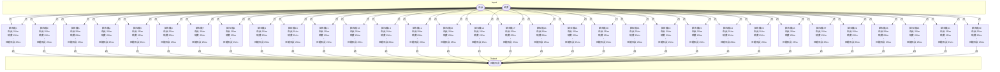

# 個別製造ライン設計書 圧縮石炭製造ライン

## 概要
以下の物品を生産する

- 圧縮石炭

## Input
- 石炭 800/m
- 硫黄 800/m

## Output
- 圧縮石炭 800/m

## 必要設備
- 組立機 32ケ
- ベルトコンベア類 適量

## 製造ライン

```mermaid
flowchart TD

subgraph Input
    石炭([石炭])
    硫黄([硫黄])
end

組立機1[
    組立機1
    石炭 25/m
    硫黄 25/m
    ↓
    圧縮石炭 25/m
]

組立機2[
    組立機2
    石炭 25/m
    硫黄 25/m
    ↓
    圧縮石炭 25/m
]

組立機3[
    組立機3
    石炭 25/m
    硫黄 25/m
    ↓
    圧縮石炭 25/m
]

組立機4[
    組立機4
    石炭 25/m
    硫黄 25/m
    ↓
    圧縮石炭 25/m
]

組立機5[
    組立機5
    石炭 25/m
    硫黄 25/m
    ↓
    圧縮石炭 25/m
]

組立機6[
    組立機6
    石炭 25/m
    硫黄 25/m
    ↓
    圧縮石炭 25/m
]

組立機7[
    組立機7
    石炭 25/m
    硫黄 25/m
    ↓
    圧縮石炭 25/m
]

組立機8[
    組立機8
    石炭 25/m
    硫黄 25/m
    ↓
    圧縮石炭 25/m
]

組立機9[
    組立機9
    石炭 25/m
    硫黄 25/m
    ↓
    圧縮石炭 25/m
]

組立機10[
    組立機10
    石炭 25/m
    硫黄 25/m
    ↓
    圧縮石炭 25/m
]

組立機11[
    組立機11
    石炭 25/m
    硫黄 25/m
    ↓
    圧縮石炭 25/m
]

組立機12[
    組立機12
    石炭 25/m
    硫黄 25/m
    ↓
    圧縮石炭 25/m
]

組立機13[
    組立機13
    石炭 25/m
    硫黄 25/m
    ↓
    圧縮石炭 25/m
]

組立機14[
    組立機14
    石炭 25/m
    硫黄 25/m
    ↓
    圧縮石炭 25/m
]

組立機15[
    組立機15
    石炭 25/m
    硫黄 25/m
    ↓
    圧縮石炭 25/m
]

組立機16[
    組立機16
    石炭 25/m
    硫黄 25/m
    ↓
    圧縮石炭 25/m
]

組立機17[
    組立機17
    石炭 25/m
    硫黄 25/m
    ↓
    圧縮石炭 25/m
]

組立機18[
    組立機18
    石炭 25/m
    硫黄 25/m
    ↓
    圧縮石炭 25/m
]

組立機19[
    組立機19
    石炭 25/m
    硫黄 25/m
    ↓
    圧縮石炭 25/m
]

組立機20[
    組立機20
    石炭 25/m
    硫黄 25/m
    ↓
    圧縮石炭 25/m
]

組立機21[
    組立機21
    石炭 25/m
    硫黄 25/m
    ↓
    圧縮石炭 25/m
]

組立機22[
    組立機22
    石炭 25/m
    硫黄 25/m
    ↓
    圧縮石炭 25/m
]

組立機23[
    組立機23
    石炭 25/m
    硫黄 25/m
    ↓
    圧縮石炭 25/m
]

組立機24[
    組立機24
    石炭 25/m
    硫黄 25/m
    ↓
    圧縮石炭 25/m
]

組立機25[
    組立機25
    石炭 25/m
    硫黄 25/m
    ↓
    圧縮石炭 25/m
]

組立機26[
    組立機26
    石炭 25/m
    硫黄 25/m
    ↓
    圧縮石炭 25/m
]

組立機27[
    組立機27
    石炭 25/m
    硫黄 25/m
    ↓
    圧縮石炭 25/m
]

組立機28[
    組立機28
    石炭 25/m
    硫黄 25/m
    ↓
    圧縮石炭 25/m
]

組立機29[
    組立機29
    石炭 25/m
    硫黄 25/m
    ↓
    圧縮石炭 25/m
]

組立機30[
    組立機30
    石炭 25/m
    硫黄 25/m
    ↓
    圧縮石炭 25/m
]

組立機31[
    組立機31
    石炭 25/m
    硫黄 25/m
    ↓
    圧縮石炭 25/m
]

組立機32[
    組立機32
    石炭 25/m
    硫黄 25/m
    ↓
    圧縮石炭 25/m
]

subgraph Output
    圧縮石炭([圧縮石炭])
end

石炭-->|25|組立機1
硫黄-->|25|組立機1
組立機1-->|25|圧縮石炭
石炭-->|25|組立機2
硫黄-->|25|組立機2
組立機2-->|25|圧縮石炭
石炭-->|25|組立機3
硫黄-->|25|組立機3
組立機3-->|25|圧縮石炭
石炭-->|25|組立機4
硫黄-->|25|組立機4
組立機4-->|25|圧縮石炭
石炭-->|25|組立機5
硫黄-->|25|組立機5
組立機5-->|25|圧縮石炭
石炭-->|25|組立機6
硫黄-->|25|組立機6
組立機6-->|25|圧縮石炭
石炭-->|25|組立機7
硫黄-->|25|組立機7
組立機7-->|25|圧縮石炭
石炭-->|25|組立機8
硫黄-->|25|組立機8
組立機8-->|25|圧縮石炭
石炭-->|25|組立機9
硫黄-->|25|組立機9
組立機9-->|25|圧縮石炭
石炭-->|25|組立機10
硫黄-->|25|組立機10
組立機10-->|25|圧縮石炭
石炭-->|25|組立機11
硫黄-->|25|組立機11
組立機11-->|25|圧縮石炭
石炭-->|25|組立機12
硫黄-->|25|組立機12
組立機12-->|25|圧縮石炭
石炭-->|25|組立機13
硫黄-->|25|組立機13
組立機13-->|25|圧縮石炭
石炭-->|25|組立機14
硫黄-->|25|組立機14
組立機14-->|25|圧縮石炭
石炭-->|25|組立機15
硫黄-->|25|組立機15
組立機15-->|25|圧縮石炭
石炭-->|25|組立機16
硫黄-->|25|組立機16
組立機16-->|25|圧縮石炭
石炭-->|25|組立機17
硫黄-->|25|組立機17
組立機17-->|25|圧縮石炭
石炭-->|25|組立機18
硫黄-->|25|組立機18
組立機18-->|25|圧縮石炭
石炭-->|25|組立機19
硫黄-->|25|組立機19
組立機19-->|25|圧縮石炭
石炭-->|25|組立機20
硫黄-->|25|組立機20
組立機20-->|25|圧縮石炭
石炭-->|25|組立機21
硫黄-->|25|組立機21
組立機21-->|25|圧縮石炭
石炭-->|25|組立機22
硫黄-->|25|組立機22
組立機22-->|25|圧縮石炭
石炭-->|25|組立機23
硫黄-->|25|組立機23
組立機23-->|25|圧縮石炭
石炭-->|25|組立機24
硫黄-->|25|組立機24
組立機24-->|25|圧縮石炭
石炭-->|25|組立機25
硫黄-->|25|組立機25
組立機25-->|25|圧縮石炭
石炭-->|25|組立機26
硫黄-->|25|組立機26
組立機26-->|25|圧縮石炭
石炭-->|25|組立機27
硫黄-->|25|組立機27
組立機27-->|25|圧縮石炭
石炭-->|25|組立機28
硫黄-->|25|組立機28
組立機28-->|25|圧縮石炭
石炭-->|25|組立機29
硫黄-->|25|組立機29
組立機29-->|25|圧縮石炭
石炭-->|25|組立機30
硫黄-->|25|組立機30
組立機30-->|25|圧縮石炭
石炭-->|25|組立機31
硫黄-->|25|組立機31
組立機31-->|25|圧縮石炭
石炭-->|25|組立機32
硫黄-->|25|組立機32
組立機32-->|25|圧縮石炭
```

## 情報
書類テンプレートバージョン : 1.5.0
