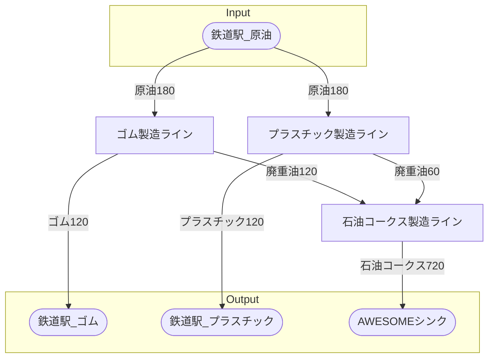

# リヨン石油加工場 全体製造ライン設計書

## 使用レシピ

### ゴム
|I/O|物品名|要求数|
|---|---|---|
|input|原油|30|
|---|---|---|
|output|ゴム|20|
|output|廃重油|20|
### プラスチック
|I/O|物品名|要求数|
|---|---|---|
|input|原油|30|
|---|---|---|
|output|プラスチック|20|
|output|廃重油|10|
### 石油コークス
|I/O|物品名|要求数|
|---|---|---|
|input|廃重油|40|
|---|---|---|
|output|石油コークス|120|

## 必要製造ライン
### ゴム製造ライン

レシピ名 : ゴム  
レシピ数 : 6

|I/O|物品名|要求数|
|---|---|---|
|input|原油|180|
|---|---|---|
|output|ゴム|120|
|output|廃重油|120|

### プラスチック製造ライン

レシピ名 : プラスチック  
レシピ数 : 6

|I/O|物品名|要求数|
|---|---|---|
|input|原油|180|
|---|---|---|
|output|プラスチック|120|
|output|廃重油|60|

### 石油コークス製造ライン

レシピ名 : 石油コークス  
レシピ数 : 5

|I/O|物品名|要求数|
|---|---|---|
|input|廃重油|200|
|---|---|---|
|output|石油コークス|600|

## 製造ラインフローチャート

## 情報
書類テンプレートバージョン : 1.7.0
