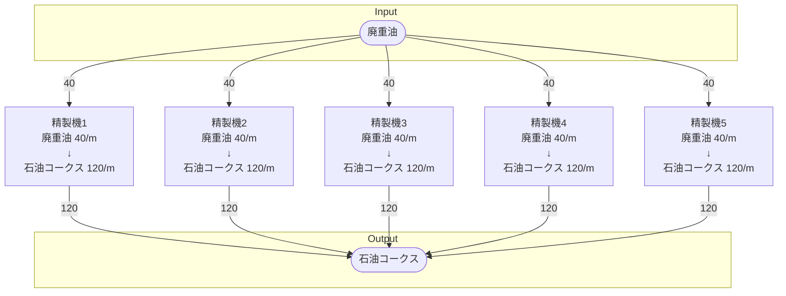

# 個別製造ライン設計書 石油コークス製造ライン

## 概要
以下の物品を生産する

- 石油コークス

## Input
- 廃重油 200/m

## Output
- 石油コークス 600/m

## 必要設備
- 精製機 5ケ
- ベルトコンベア類 適量

## 製造ライン

```mermaid
flowchart TD

subgraph Input
    廃重油([廃重油])
end

精製機1[
    精製機1
    廃重油 40/m
    ↓
    石油コークス 120/m
]

精製機2[
    精製機2
    廃重油 40/m
    ↓
    石油コークス 120/m
]

精製機3[
    精製機3
    廃重油 40/m
    ↓
    石油コークス 120/m
]

精製機4[
    精製機4
    廃重油 40/m
    ↓
    石油コークス 120/m
]

精製機5[
    精製機5
    廃重油 40/m
    ↓
    石油コークス 120/m
]

subgraph Output
    石油コークス([石油コークス])
end

廃重油-->|40|精製機1
精製機1-->|120|石油コークス
廃重油-->|40|精製機2
精製機2-->|120|石油コークス
廃重油-->|40|精製機3
精製機3-->|120|石油コークス
廃重油-->|40|精製機4
精製機4-->|120|石油コークス
廃重油-->|40|精製機5
精製機5-->|120|石油コークス
```

## 情報
書類テンプレートバージョン : 1.5.0
