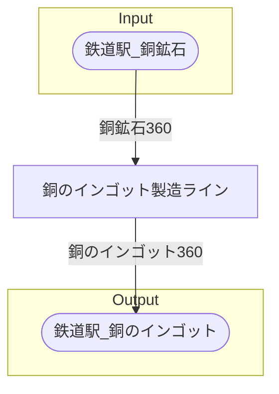

# ヴッパータール銅精錬場 全体製造ライン設計書

## 使用レシピ

### 銅のインゴット
|I/O|物品名|要求数|
|---|---|---|
|input|銅鉱石|30|
|---|---|---|
|output|銅のインゴット|30|

## 必要製造ライン
### 銅のインゴット製造ライン

レシピ名 : 銅のインゴット  
レシピ数 : 12

|I/O|物品名|要求数|
|---|---|---|
|input|銅鉱石|360|
|---|---|---|
|output|銅のインゴット|360|

## 製造ラインフローチャート

## 情報
書類テンプレートバージョン : 1.7.0
