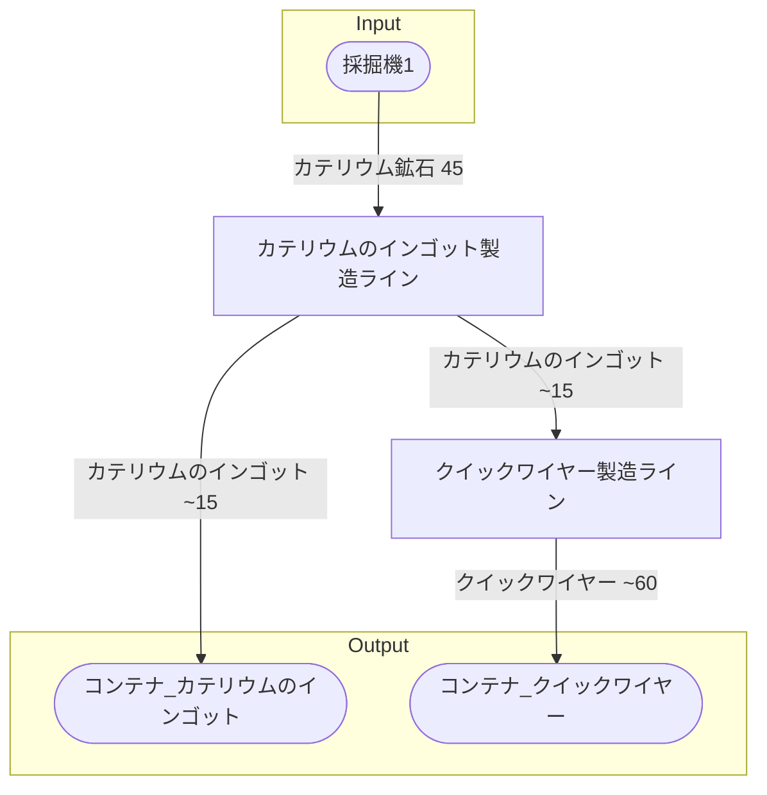

# 初期一時カテリウム工場 全体製造ライン設計書

## 使用レシピ
### カテリウムのインゴット
|Input|Output|
|---|---|
|カテリウム鉱石 45/m|カテリウムのインゴット 15/m|
### クイックワイヤー
|Input|Output|
|---|---|
|カテリウムのインゴット 12/m|クイックワイヤー 60/m|

## 必要製造ライン
### カテリウムのインゴット製造ライン
|レシピ名|数|Input計|Output計|
|---|---|---|---|
|カテリウムのインゴット|1|カテリウム鉱石 45/m|カテリウムのインゴット 15/m|
### クイックワイヤー製造ライン
|レシピ名|数|Input計|Output計|
|---|---|---|---|
|クイックワイヤー|1|カテリウムのインゴット 12/m|クイックワイヤー 60/m|

## 製造ラインフローチャート

## 情報
書類テンプレートバージョン : 1.7.0
