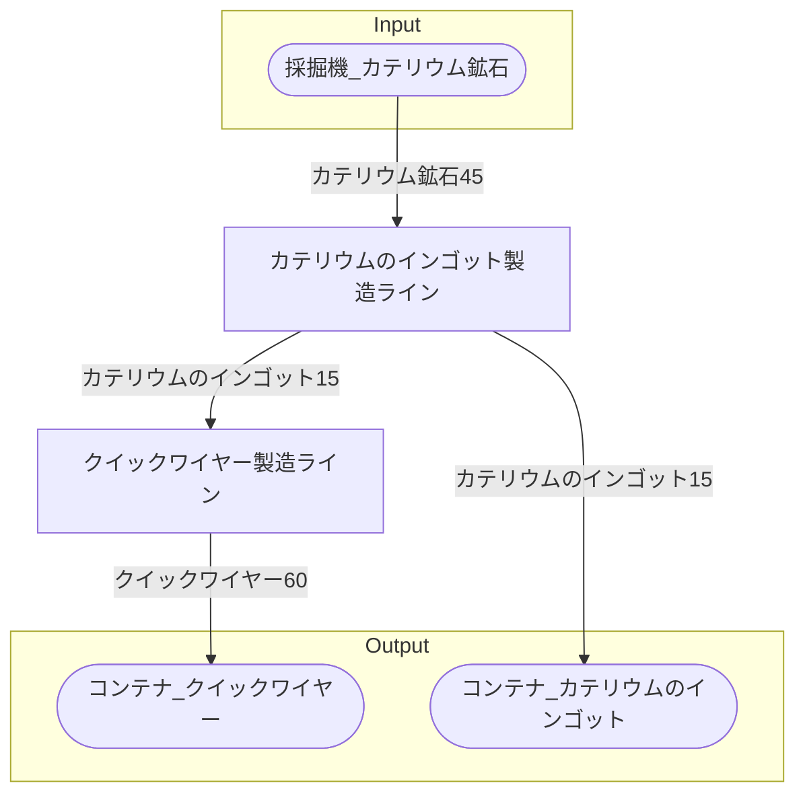

# 初期一時カテリウム工場 全体製造ライン設計書

## 使用レシピ

### カテリウムのインゴット
|I/O|物品名|要求数|
|---|---|---|
|input|カテリウム鉱石|45|
|---|---|---|
|output|カテリウムのインゴット|15|
### クイックワイヤー
|I/O|物品名|要求数|
|---|---|---|
|input|カテリウムのインゴット|12|
|---|---|---|
|output|クイックワイヤー|60|

## 必要製造ライン
### カテリウムのインゴット製造ライン

レシピ名 : カテリウムのインゴット  
レシピ数 : 1

|I/O|物品名|要求数|
|---|---|---|
|input|カテリウム鉱石|45|
|---|---|---|
|output|カテリウムのインゴット|15|

### クイックワイヤー製造ライン

レシピ名 : クイックワイヤー  
レシピ数 : 1

|I/O|物品名|要求数|
|---|---|---|
|input|カテリウムのインゴット|12|
|---|---|---|
|output|クイックワイヤー|60|

## 製造ラインフローチャート

## 情報
書類テンプレートバージョン : 1.7.0
