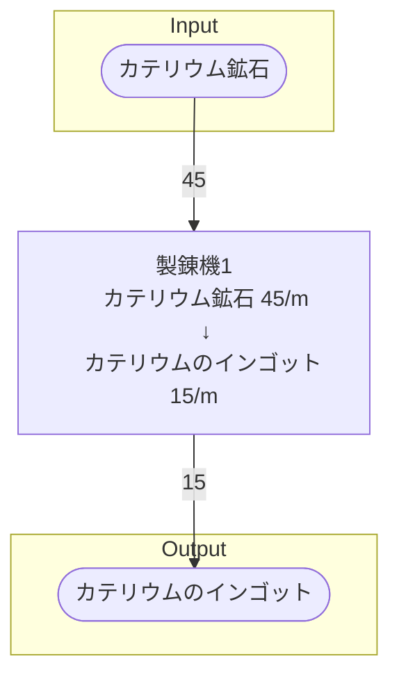

# 個別製造ライン設計書 カテリウムのインゴット製造ライン

## 概要
カテリウムのインゴットを製造するライン

## Input
- カテリウム鉱石 45/m

## Output
- カテリウムのインゴット 15/m

## 必要設備
- 製錬機 1ケ
- ベルトコンベア類 適量

## 製造ライン

```mermaid
flowchart TD

subgraph Input
    カテリウム鉱石([カテリウム鉱石])
end

製錬機1[
    製錬機1
    カテリウム鉱石 45/m
    ↓
    カテリウムのインゴット 15/m
]

subgraph Output
    カテリウムのインゴット([カテリウムのインゴット])
end

カテリウム鉱石-->|45|製錬機1
製錬機1-->|15|カテリウムのインゴット
```

## 情報
書類テンプレートバージョン : 1.5.0
