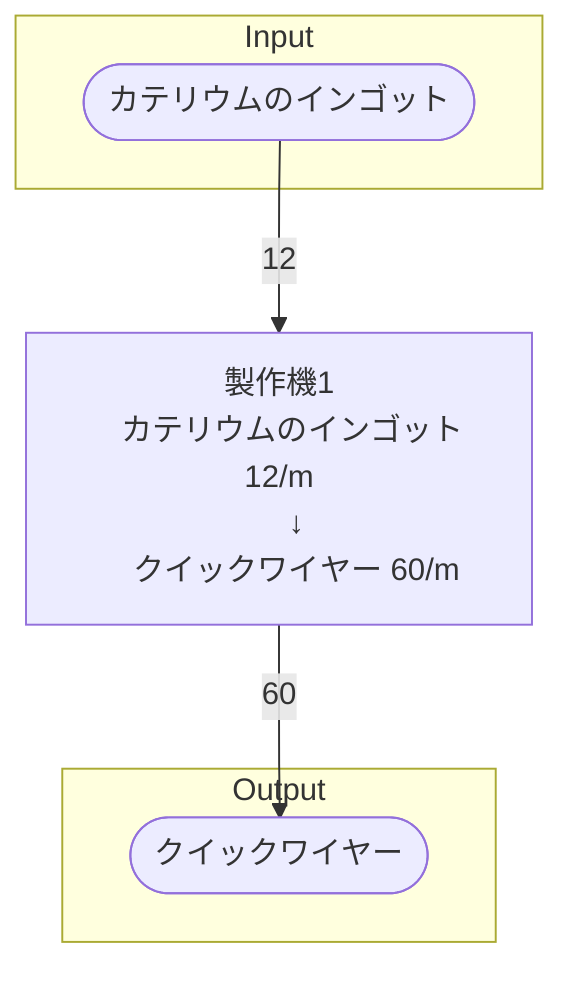

# 個別製造ライン設計書 クイックワイヤー製造ライン

## 概要
クイックワイヤーを製造するライン

## Input
- カテリウムのインゴット 12/m

## Output
- クイックワイヤー 60/m

## 必要設備
- 製作機 1ケ
- ベルトコンベア類 適量

## 製造ライン

```mermaid
flowchart TD

subgraph Input
    カテリウムのインゴット([カテリウムのインゴット])
end

製作機1[
    製作機1
    カテリウムのインゴット 12/m
    ↓
    クイックワイヤー 60/m
]

subgraph Output
    クイックワイヤー([クイックワイヤー])
end

カテリウムのインゴット-->|12|製作機1
製作機1-->|60|クイックワイヤー
```

## 情報
書類テンプレートバージョン : 1.5.0
