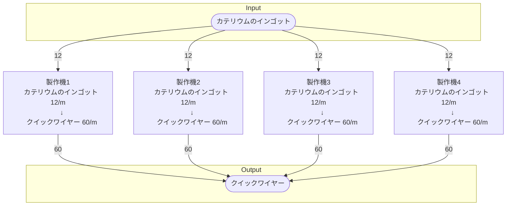

# 個別製造ライン設計書 クイックワイヤー製造ライン

## 概要
以下の物品を生産する

- クイックワイヤー

## Input
- カテリウムのインゴット 48/m

## Output
- クイックワイヤー 240/m

## 必要設備
- 製作機 4ケ
- ベルトコンベア類 適量

## 製造ライン

```mermaid
flowchart TD

subgraph Input
    カテリウムのインゴット([カテリウムのインゴット])
end

製作機1[
    製作機1
    カテリウムのインゴット 12/m
    ↓
    クイックワイヤー 60/m
]

製作機2[
    製作機2
    カテリウムのインゴット 12/m
    ↓
    クイックワイヤー 60/m
]

製作機3[
    製作機3
    カテリウムのインゴット 12/m
    ↓
    クイックワイヤー 60/m
]

製作機4[
    製作機4
    カテリウムのインゴット 12/m
    ↓
    クイックワイヤー 60/m
]

subgraph Output
    クイックワイヤー([クイックワイヤー])
end

カテリウムのインゴット-->|12|製作機1
製作機1-->|60|クイックワイヤー
カテリウムのインゴット-->|12|製作機2
製作機2-->|60|クイックワイヤー
カテリウムのインゴット-->|12|製作機3
製作機3-->|60|クイックワイヤー
カテリウムのインゴット-->|12|製作機4
製作機4-->|60|クイックワイヤー
```

## 情報
書類テンプレートバージョン : 1.5.0
