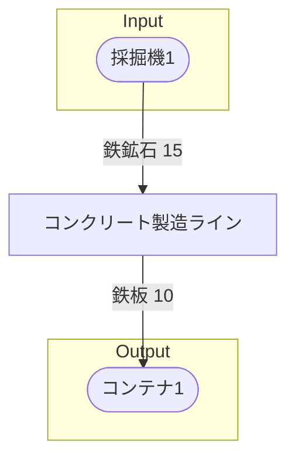

# 初期一時コンクリート工場 全体製造ライン設計書

## 使用レシピ
### コンクリート
|Input|Output|
|---|---|
|石灰岩 45/m|鉄のインゴット 15/m|

## 必要製造ライン
### コンクリート製造ライン
|レシピ名|数|Input計|Output計|
|---|---|---|---|
|コンクリート|1|石灰岩 45/m|鉄のインゴット 15/m|

## 製造ラインフローチャート

## 情報
書類テンプレートバージョン : 1.7.0
