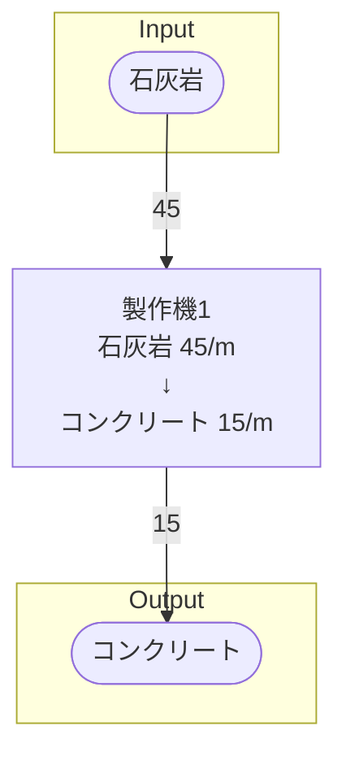

# 個別製造ライン設計書 コンクリート製造ライン

## 概要
以下の物品を生産する

- コンクリート

## Input
- 石灰岩 45/m

## Output
- コンクリート 15/m

## 必要設備
- 製作機 1ケ
- ベルトコンベア類 適量

## 製造ライン

```mermaid
flowchart TD

subgraph Input
    石灰岩([石灰岩])
end

製作機1[
    製作機1
    石灰岩 45/m
    ↓
    コンクリート 15/m
]

subgraph Output
    コンクリート([コンクリート])
end

石灰岩-->|45|製作機1
製作機1-->|15|コンクリート
```

## 情報
書類テンプレートバージョン : 1.5.0
