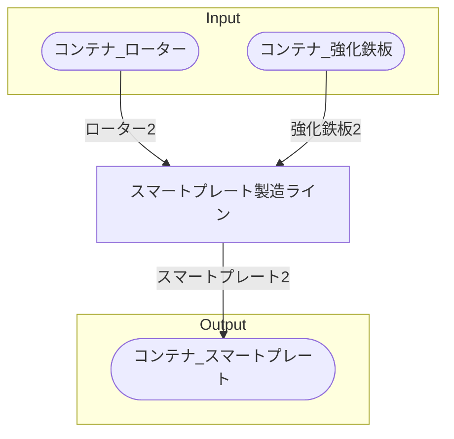

# 初期一時スマートプレート工場 全体製造ライン設計書

## 使用レシピ

### スマートプレート
|I/O|物品名|要求数|
|---|---|---|
|input|ローター|2|
|input|強化鉄板|2|
|---|---|---|
|output|スマートプレート|2|

## 必要製造ライン
### スマートプレート製造ライン

レシピ名 : スマートプレート  
レシピ数 : 1

|I/O|物品名|要求数|
|---|---|---|
|input|ローター|2|
|input|強化鉄板|2|
|---|---|---|
|output|スマートプレート|2|

## 製造ラインフローチャート

## 情報
書類テンプレートバージョン : 1.7.0
