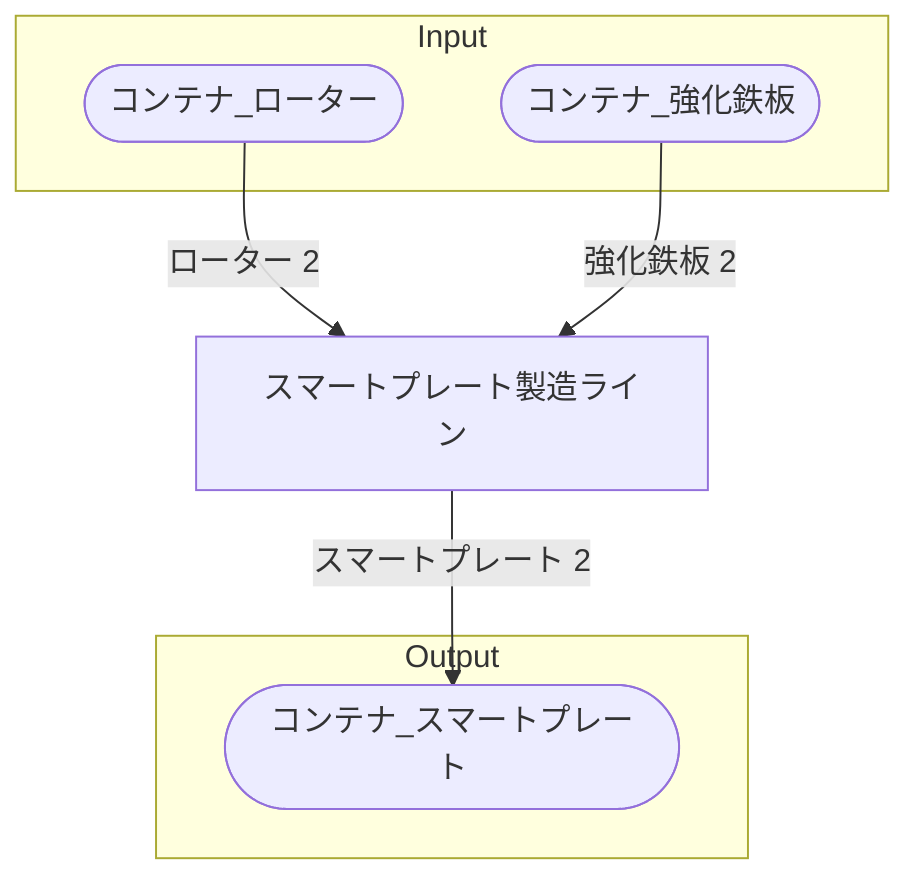

# 初期一時スマートプレート工場 全体製造ライン設計書

## 使用レシピ
### スマートプレート
|Input|Output|
|---|---|
|ローター 2/m|スマートプレート 2/m|
|強化鉄板 2/m|

## 必要製造ライン
### スマートプレート製造ライン
|レシピ名|数|Input計|Output計|
|---|---|---|---|
|スマートプレート|1|ローター 2/m|強化鉄板 2/m|

## 製造ラインフローチャート

## 情報
書類テンプレートバージョン : 1.7.0
