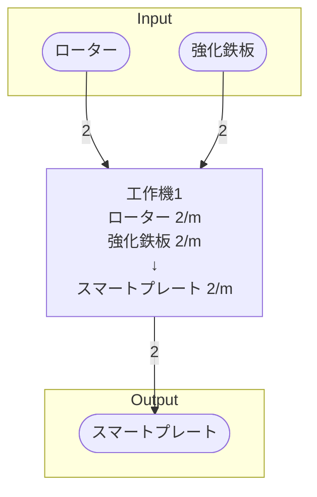

# 個別製造ライン設計書 スマートプレート製造ライン

## 概要
ローターと強化鉄板からスマートプレートを製造するライン

## Input
- ローター 2/m
- 強化鉄板 2/m

## Output
- スマートプレート 2/m

## 必要設備
- 工作機 1ケ
- ベルトコンベア類 適量

## 製造ライン

```mermaid
flowchart TD

subgraph Input
    ローター([ローター])
    強化鉄板([強化鉄板])
end

工作機1[
    工作機1
    ローター 2/m
    強化鉄板 2/m
    ↓
    スマートプレート 2/m
]

subgraph Output
    スマートプレート([スマートプレート])
end

ローター-->|2|工作機1
強化鉄板-->|2|工作機1
工作機1-->|2|スマートプレート
```

## 情報
書類テンプレートバージョン : 1.5.0
