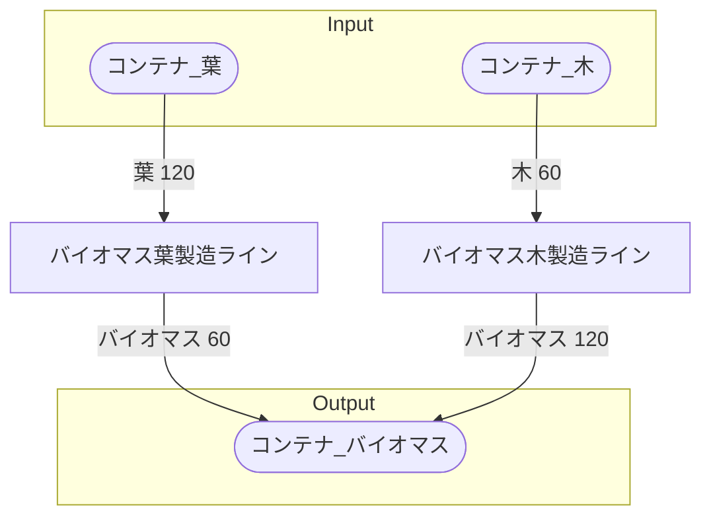

# 初期一時バイオマス工場 全体製造ライン設計書

## 使用レシピ
### バイオマス葉
|Input|Output|
|---|---|
|葉 120/m|バイオマス 60/m|
### バイオマス木
|Input|Output|
|---|---|
|木 60/m|バイオマス 300/m|

## 必要製造ライン
### バイオマス葉製造ライン
|レシピ名|数|Input計|Output計|
|---|---|---|---|
|バイオマス葉|1|葉 120/m|バイオマス 60/m|
### バイオマス木製造ライン
|レシピ名|数|Input計|Output計|
|---|---|---|---|
|バイオマス木|1|木 60/m|バイオマス 300/m|

## 製造ラインフローチャート

## 情報
書類テンプレートバージョン : 1.7.0
