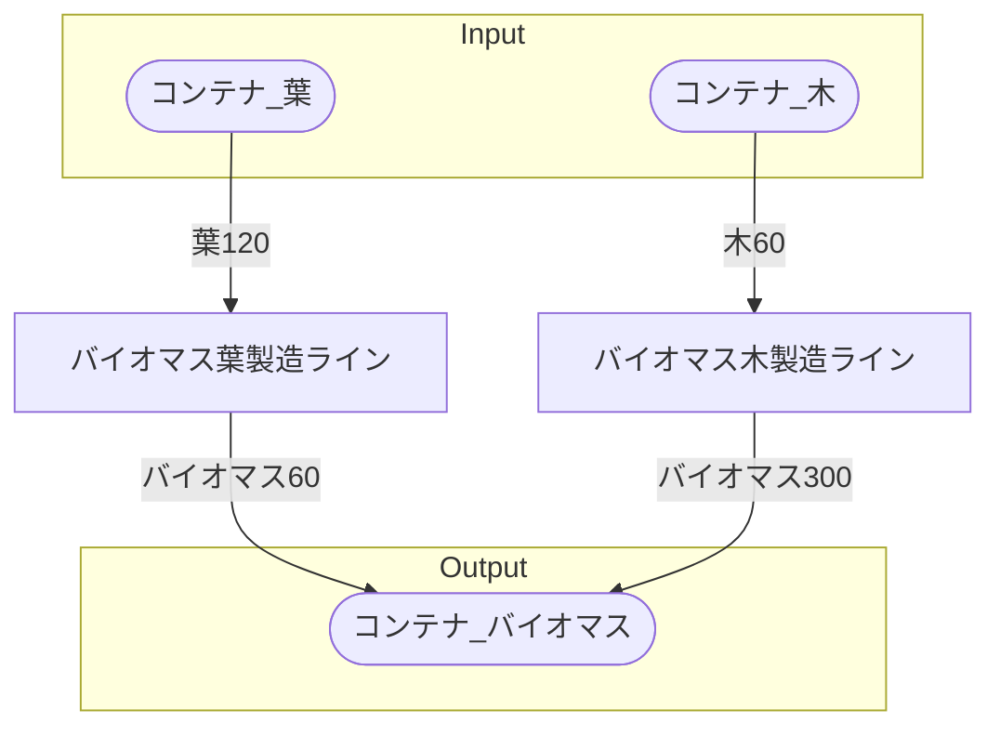

# 初期一時バイオマス工場 全体製造ライン設計書

## 使用レシピ

### バイオマス葉
|I/O|物品名|要求数|
|---|---|---|
|input|葉|120|
|---|---|---|
|output|バイオマス|60|
### バイオマス木
|I/O|物品名|要求数|
|---|---|---|
|input|木|60|
|---|---|---|
|output|バイオマス|300|

## 必要製造ライン
### バイオマス葉製造ライン

レシピ名 : バイオマス葉  
レシピ数 : 1

|I/O|物品名|要求数|
|---|---|---|
|input|葉|120|
|---|---|---|
|output|バイオマス|60|

### バイオマス木製造ライン

レシピ名 : バイオマス木  
レシピ数 : 1

|I/O|物品名|要求数|
|---|---|---|
|input|木|60|
|---|---|---|
|output|バイオマス|300|

## 製造ラインフローチャート

## 情報
書類テンプレートバージョン : 1.7.0
