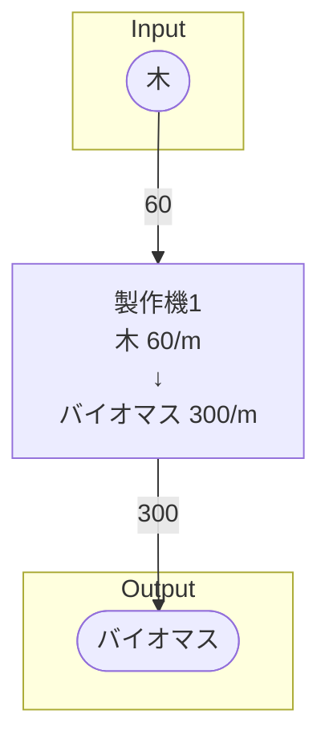

# 個別製造ライン設計書 バイオマス木製造ライン

## 概要
以下の物品を生産する

- バイオマス

## Input
- 木 60/m

## Output
- バイオマス 300/m

## 必要設備
- 製作機 1ケ
- ベルトコンベア類 適量

## 製造ライン

```mermaid
flowchart TD

subgraph Input
    木([木])
end

製作機1[
    製作機1
    木 60/m
    ↓
    バイオマス 300/m
]

subgraph Output
    バイオマス([バイオマス])
end

木-->|60|製作機1
製作機1-->|300|バイオマス
```

## 情報
書類テンプレートバージョン : 1.5.0
