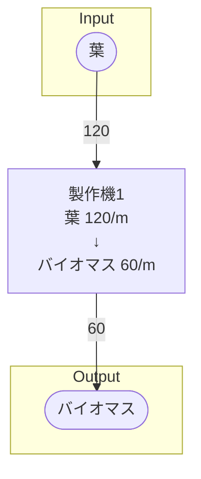

# 個別製造ライン設計書 バイオマス葉製造ライン

## 概要
以下の物品を生産する

- バイオマス

## Input
- 葉 120/m

## Output
- バイオマス 60/m

## 必要設備
- 製作機 1ケ
- ベルトコンベア類 適量

## 製造ライン

```mermaid
flowchart TD

subgraph Input
    葉([葉])
end

製作機1[
    製作機1
    葉 120/m
    ↓
    バイオマス 60/m
]

subgraph Output
    バイオマス([バイオマス])
end

葉-->|120|製作機1
製作機1-->|60|バイオマス
```

## 情報
書類テンプレートバージョン : 1.5.0
