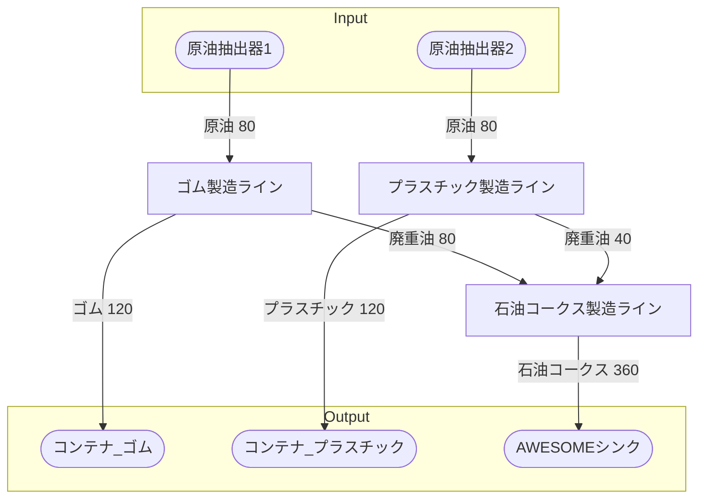

# 初期一時プラスチック工場 全体製造ライン設計書

## 使用レシピ
### ゴム
|Input|Output|
|---|---|
|原油 30/m|ゴム 20/m|
||廃重油 20/m|
### プラスチック
|Input|Output|
|---|---|
|原油 30/m|プラスチック 20/m|
||廃重油 10/m|
### 石油コークス
|Input|Output|
|---|---|
|廃重油 40/m|石油コークス 120/m|

## 必要製造ライン
### ゴム製造ライン
|レシピ名|数|Input計|Output計|
|---|---|---|---|
|ゴム|4|原油 120/m|ゴム 80/m|
||||廃重油 80/m|
### プラスチック製造ライン
|レシピ名|数|Input計|Output計|
|---|---|---|---|
|プラスチック|4|原油 120/m|プラスチック 80/m|
||||廃重油 40/m|
### 石油コークス製造ライン
|レシピ名|数|Input計|Output計|
|---|---|---|---|
|石油コークス|3|廃重油 120/m|石油コークス 360/m|

## 製造ラインフローチャート

## 情報
書類テンプレートバージョン : 1.7.0
