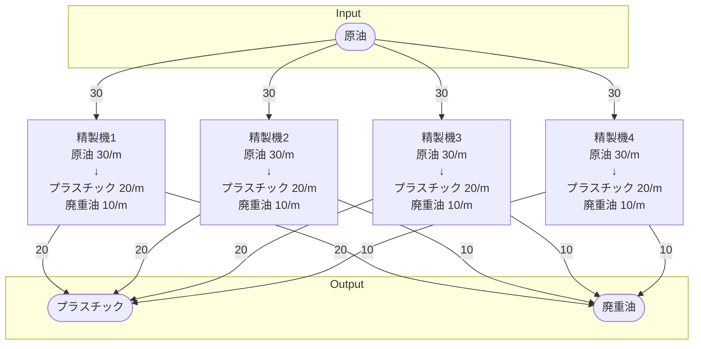

# 個別製造ライン設計書 プラスチック製造ライン

## 概要
以下の物品を生産する

- プラスチック
- 廃重油

## Input
- 原油 120/m

## Output
- プラスチック 80/m
- 廃重油 40/m

## 必要設備
- 精製機 4ケ
- ベルトコンベア類 適量

## 製造ライン

```mermaid
flowchart TD

subgraph Input
    原油([原油])
end

精製機1[
    精製機1
    原油 30/m
    ↓
    プラスチック 20/m
    廃重油 10/m
]

精製機2[
    精製機2
    原油 30/m
    ↓
    プラスチック 20/m
    廃重油 10/m
]

精製機3[
    精製機3
    原油 30/m
    ↓
    プラスチック 20/m
    廃重油 10/m
]

精製機4[
    精製機4
    原油 30/m
    ↓
    プラスチック 20/m
    廃重油 10/m
]

subgraph Output
    プラスチック([プラスチック])
    廃重油([廃重油])
end

原油-->|30|精製機1
精製機1-->|20|プラスチック
精製機1-->|10|廃重油
原油-->|30|精製機2
精製機2-->|20|プラスチック
精製機2-->|10|廃重油
原油-->|30|精製機3
精製機3-->|20|プラスチック
精製機3-->|10|廃重油
原油-->|30|精製機4
精製機4-->|20|プラスチック
精製機4-->|10|廃重油
```

## 情報
書類テンプレートバージョン : 1.5.0
