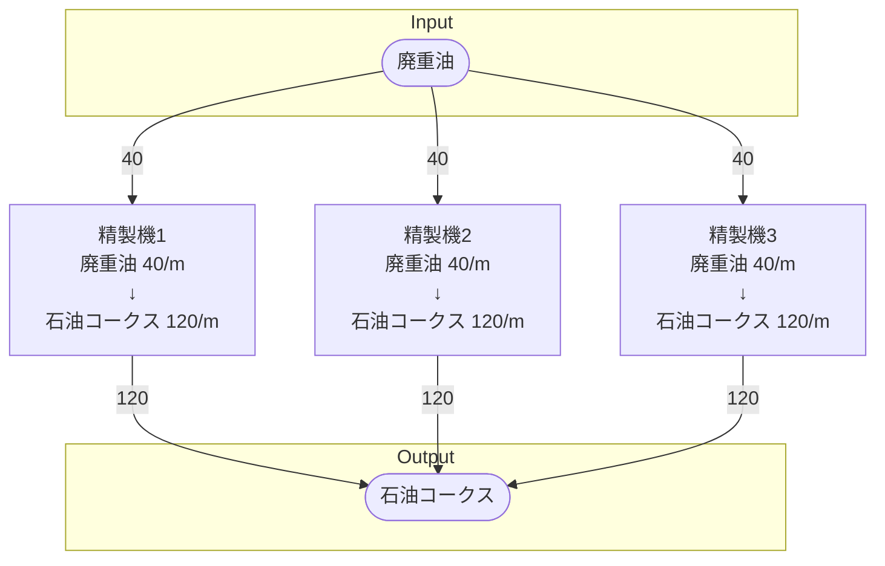

# 個別製造ライン設計書 石油コークス製造ライン

## 概要
石油コークスを製造するライン

## Input
- 廃重油 120/m

## Output
- 石油コークス 360/m

## 必要設備
- 精製機 3ケ
- ベルトコンベア類 適量

## 製造ライン

```mermaid
flowchart TD

subgraph Input
    廃重油([廃重油])
end

精製機1[
    精製機1
    廃重油 40/m
    ↓
    石油コークス 120/m
]

精製機2[
    精製機2
    廃重油 40/m
    ↓
    石油コークス 120/m
]

精製機3[
    精製機3
    廃重油 40/m
    ↓
    石油コークス 120/m
]

subgraph Output
    石油コークス([石油コークス])
end

廃重油-->|40|精製機1
精製機1-->|120|石油コークス
廃重油-->|40|精製機2
精製機2-->|120|石油コークス
廃重油-->|40|精製機3
精製機3-->|120|石油コークス
```

## 情報
書類テンプレートバージョン : 1.5.0
