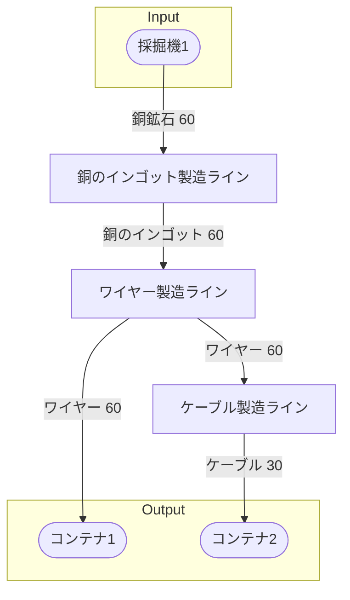

# 初期一時ワイヤー工場 全体製造ライン設計書

## 使用レシピ
### 銅のインゴット
|Input|Output|
|---|---|
|銅鉱石 30/m|銅のインゴット 30/m|
### ワイヤー
|Input|Output|
|---|---|
|銅のインゴット 15/m|ワイヤー 30/m|
### ケーブル
|Input|Output|
|---|---|
|銅のインゴット 60/m|ケーブル 30/m|

## 必要製造ライン

### 銅のインゴット製造ライン
|レシピ名|数|Input計|Output計|
|---|---|---|---|
|銅のインゴット|2|銅鉱石 60/m|鉄のインゴット 60/m|

### ワイヤー製造ライン
|レシピ名|数|Input計|Output計|
|---|---|---|---|
|ワイヤー|4|銅のインゴット 60/m|ワイヤー 120/m|

### ケーブル製造ライン
|レシピ名|数|Input計|Output計|
|---|---|---|---|
|ワイヤー|1|ワイヤー 60/m|ケーブル 30/m|

## 製造ラインフローチャート

## 情報
書類テンプレートバージョン : 1.7.0
