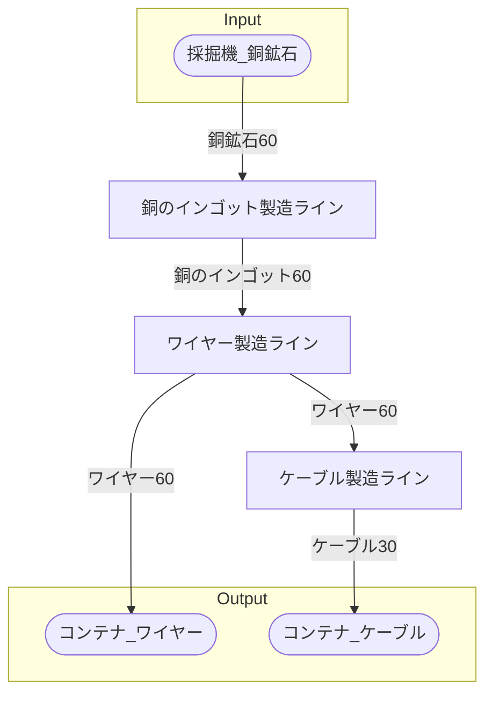

# 初期一時ワイヤー工場 全体製造ライン設計書

## 使用レシピ

### 銅のインゴット
|I/O|物品名|要求数|
|---|---|---|
|input|銅鉱石|30|
|---|---|---|
|output|銅のインゴット|30|
### ケーブル
|I/O|物品名|要求数|
|---|---|---|
|input|ワイヤー|60|
|---|---|---|
|output|ケーブル|30|

## 必要製造ライン
### 銅のインゴット製造ライン

レシピ名 : 銅のインゴット  
レシピ数 : 2

|I/O|物品名|要求数|
|---|---|---|
|input|銅鉱石|60|
|---|---|---|
|output|銅のインゴット|60|

### ケーブル製造ライン

レシピ名 : ケーブル  
レシピ数 : 1

|I/O|物品名|要求数|
|---|---|---|
|input|ワイヤー|60|
|---|---|---|
|output|ケーブル|30|

## 製造ラインフローチャート

## 情報
書類テンプレートバージョン : 1.7.0
