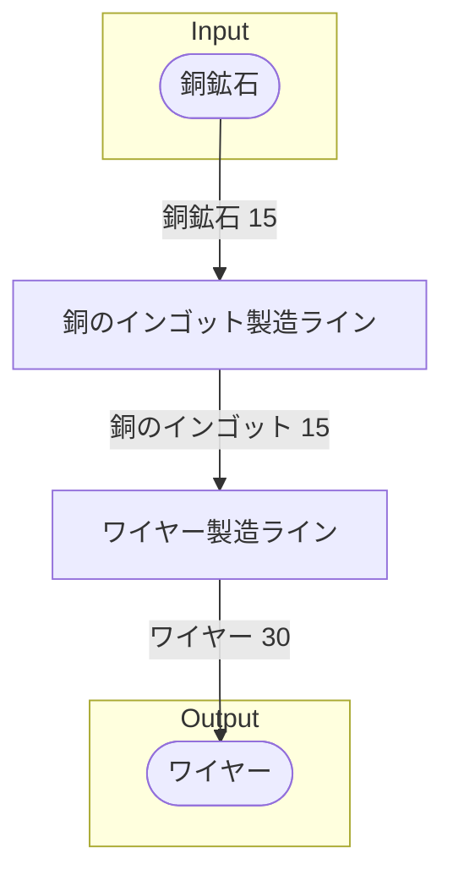

# (工場名) 全体製造ライン設計書

## 使用レシピ
### 銅のインゴット
|Input|Output|
|---|---|
|銅鉱石 30/m|銅のインゴット 30/m|
### ワイヤー
|Input|Output|
|---|---|
|銅のインゴット 15/m|ワイヤー 30/m|

## 必要製造ライン
### 銅のインゴット製造ライン
|レシピ名|数|Input計|Output計|
|---|---|---|---|
|銅のインゴット|1|銅鉱石 30/m|鉄のインゴット 30/m|
### ワイヤー製造ライン
|レシピ名|数|Input計|Output計|
|---|---|---|---|
|ワイヤー|1|銅のインゴット 15/m|ワイヤー 20/m|

## 製造ラインフローチャート

## 情報
書類バージョン : 1.4.0
