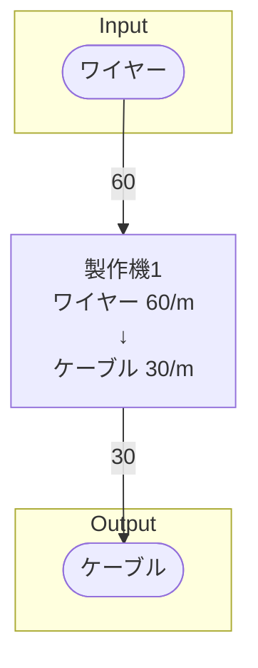

# 個別製造ライン設計書 ケーブル製造ライン

## 概要
以下の物品を生産する

- ケーブル

## Input
- ワイヤー 60/m

## Output
- ケーブル 30/m

## 必要設備
- 製作機 1ケ
- ベルトコンベア類 適量

## 製造ライン

```mermaid
flowchart TD

subgraph Input
    ワイヤー([ワイヤー])
end

製作機1[
    製作機1
    ワイヤー 60/m
    ↓
    ケーブル 30/m
]

subgraph Output
    ケーブル([ケーブル])
end

ワイヤー-->|60|製作機1
製作機1-->|30|ケーブル
```

## 情報
書類テンプレートバージョン : 1.5.0
