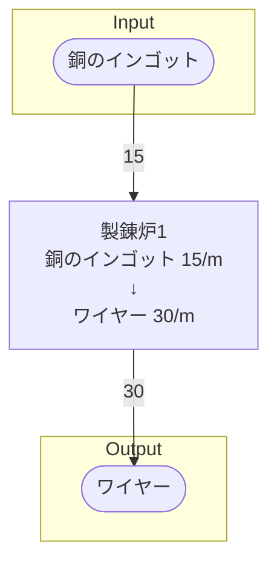

# 個別製造ライン設計書 ワイヤー製造ライン

## 概要
初期一時工場の銅のインゴットからワイヤーを制作するライン

## Input
- 銅のインゴット 15/m

## Output
  - ワイヤー 30/m
    - Output行き 30/m

## 必要設備
- 製作機 1
- ベルトコンベア類 適量

## 製造ライン

```mermaid
flowchart TD

subgraph Input
    銅のインゴット([銅のインゴット])
end

製錬炉1[
    製錬炉1
    銅のインゴット 15/m
    ↓
    ワイヤー 30/m
]

subgraph Output
    ワイヤー([ワイヤー])
end


銅のインゴット-->|15|製錬炉1
製錬炉1-->|30|ワイヤー


```

## 情報
書類バージョン : 1.3.0
