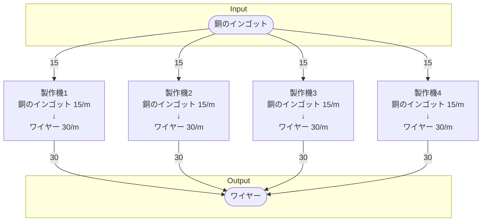

# 個別製造ライン設計書 ワイヤー製造ライン

## 概要
初期一時工場の銅のインゴットからワイヤーを制作するライン

## Input
- 銅のインゴット 60/m

## Output
- ワイヤー 120/m

## 必要設備
- 製作機 4
- ベルトコンベア類 適量

## 製造ライン

```mermaid
flowchart TD

subgraph Input
    銅のインゴット([銅のインゴット])
end

製作機1[
    製作機1
    銅のインゴット 15/m
    ↓
    ワイヤー 30/m
]
製作機2[
    製作機2
    銅のインゴット 15/m
    ↓
    ワイヤー 30/m
]
製作機3[
    製作機3
    銅のインゴット 15/m
    ↓
    ワイヤー 30/m
]
製作機4[
    製作機4
    銅のインゴット 15/m
    ↓
    ワイヤー 30/m
]

subgraph Output
    ワイヤー([ワイヤー])
end


銅のインゴット-->|15|製作機1
銅のインゴット-->|15|製作機2
銅のインゴット-->|15|製作機3
銅のインゴット-->|15|製作機4
製作機1-->|30|ワイヤー
製作機2-->|30|ワイヤー
製作機3-->|30|ワイヤー
製作機4-->|30|ワイヤー


```

## 情報
書類テンプレートバージョン : 1.5.0
