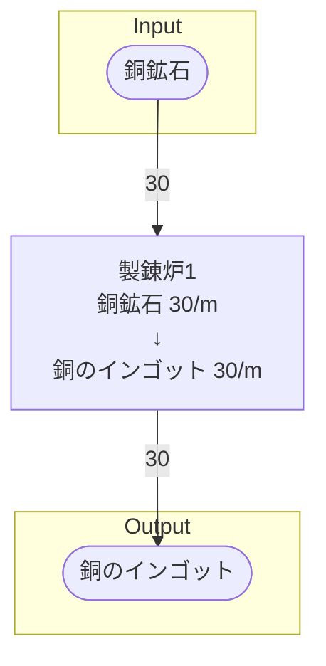

# 個別製造ライン設計書 銅のインゴット 製造ライン

## 概要
初期一時工場の銅鉱石から銅のインゴットを製錬するライン

## Input
- 銅鉱石 30/m

## Output
- 銅インゴット 30/m
    - ワイヤーライン行き 30/m

## 必要設備
- 製錬炉 1
- ベルトコンベア類 適量

## 製造ライン

```mermaid
flowchart TD

subgraph Input
    銅鉱石([銅鉱石])
end

製錬炉1[
    製錬炉1
    銅鉱石 30/m
    ↓
    銅のインゴット 30/m
]

subgraph Output
    銅のインゴット([銅のインゴット])
end


銅鉱石-->|30|製錬炉1
製錬炉1-->|30|銅のインゴット


```

## 情報
書類バージョン : 1.3.0
