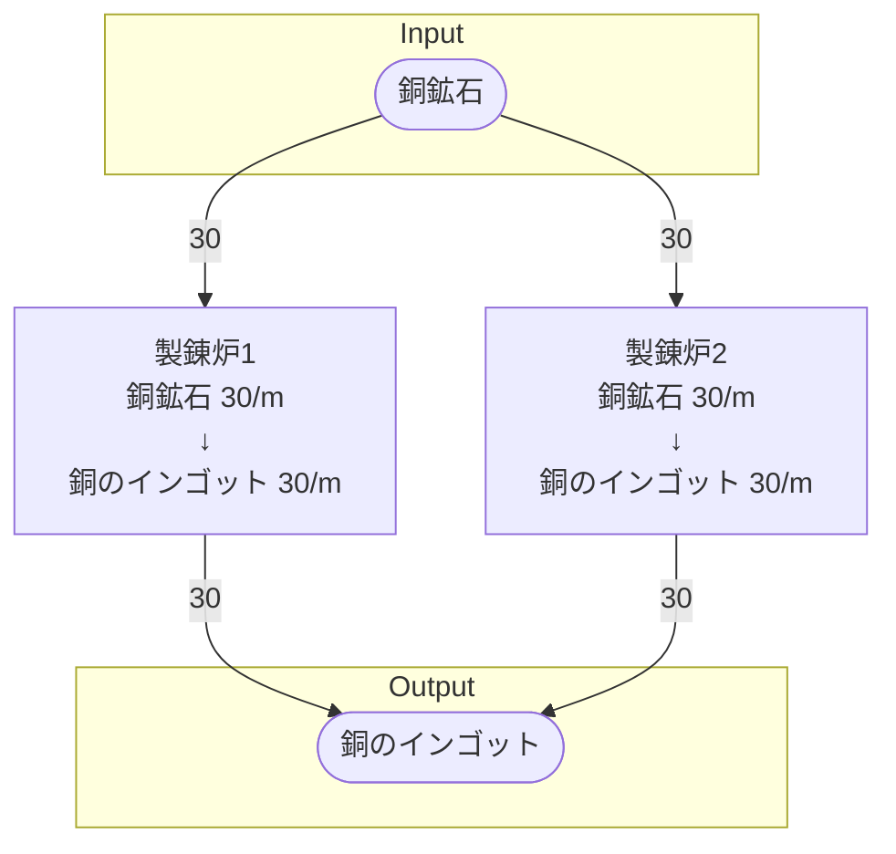

# 個別製造ライン設計書 銅のインゴット製造ライン

## 概要
以下の物品を生産する

- 銅のインゴット

## Input
- 銅鉱石 60/m

## Output
- 銅のインゴット 60/m

## 必要設備
- 製錬炉 2ケ
- ベルトコンベア類 適量

## 製造ライン

```mermaid
flowchart TD

subgraph Input
    銅鉱石([銅鉱石])
end

製錬炉1[
    製錬炉1
    銅鉱石 30/m
    ↓
    銅のインゴット 30/m
]

製錬炉2[
    製錬炉2
    銅鉱石 30/m
    ↓
    銅のインゴット 30/m
]

subgraph Output
    銅のインゴット([銅のインゴット])
end

銅鉱石-->|30|製錬炉1
製錬炉1-->|30|銅のインゴット
銅鉱石-->|30|製錬炉2
製錬炉2-->|30|銅のインゴット
```

## 情報
書類テンプレートバージョン : 1.5.0
