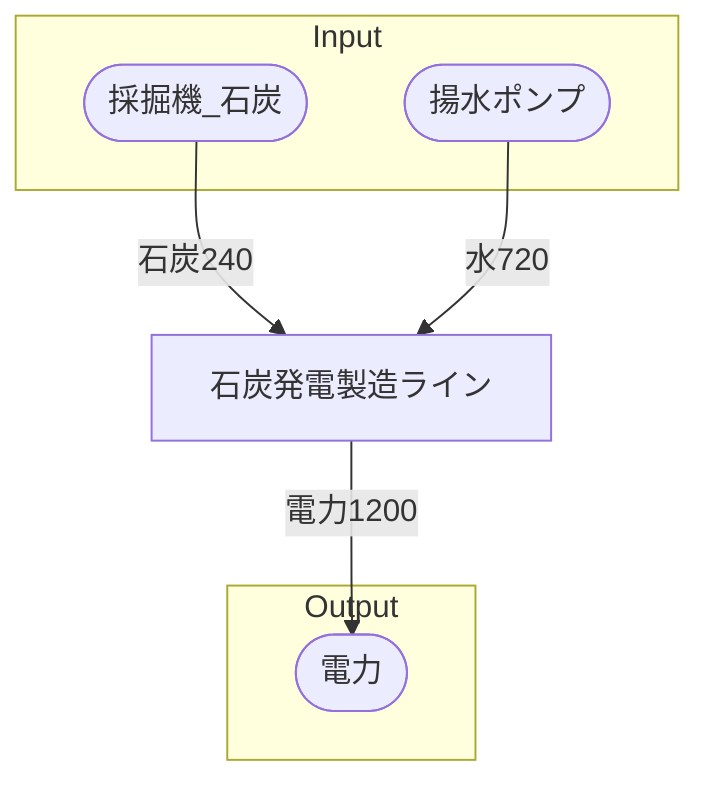

# 初期一時石炭発電所 全体製造ライン設計書

## 使用レシピ

### 石炭発電
|I/O|物品名|要求数|
|---|---|---|
|input|石炭|15|
|input|水|45|
|---|---|---|

## 必要製造ライン
### 石炭発電製造ライン

レシピ名 : 石炭発電  
レシピ数 : 16

|I/O|物品名|要求数|
|---|---|---|
|input|石炭|240|
|input|水|720|
|---|---|---|

## 製造ラインフローチャート

## 情報
書類テンプレートバージョン : 1.7.0
