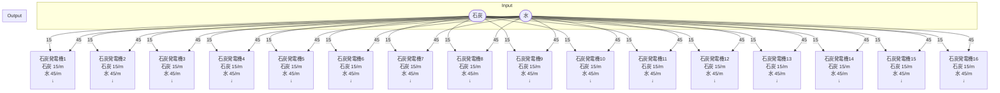

# 個別製造ライン設計書 石炭発電製造ライン

## 概要
以下の物品を生産する

## Input
- 石炭 240/m
- 水 720/m

## Output

## 必要設備
- 石炭発電機 16ケ
- ベルトコンベア類 適量

## 製造ライン

```mermaid
flowchart TD

subgraph Input
    石炭([石炭])
    水([水])
end

石炭発電機1[
    石炭発電機1
    石炭 15/m
    水 45/m
    ↓
]

石炭発電機2[
    石炭発電機2
    石炭 15/m
    水 45/m
    ↓
]

石炭発電機3[
    石炭発電機3
    石炭 15/m
    水 45/m
    ↓
]

石炭発電機4[
    石炭発電機4
    石炭 15/m
    水 45/m
    ↓
]

石炭発電機5[
    石炭発電機5
    石炭 15/m
    水 45/m
    ↓
]

石炭発電機6[
    石炭発電機6
    石炭 15/m
    水 45/m
    ↓
]

石炭発電機7[
    石炭発電機7
    石炭 15/m
    水 45/m
    ↓
]

石炭発電機8[
    石炭発電機8
    石炭 15/m
    水 45/m
    ↓
]

石炭発電機9[
    石炭発電機9
    石炭 15/m
    水 45/m
    ↓
]

石炭発電機10[
    石炭発電機10
    石炭 15/m
    水 45/m
    ↓
]

石炭発電機11[
    石炭発電機11
    石炭 15/m
    水 45/m
    ↓
]

石炭発電機12[
    石炭発電機12
    石炭 15/m
    水 45/m
    ↓
]

石炭発電機13[
    石炭発電機13
    石炭 15/m
    水 45/m
    ↓
]

石炭発電機14[
    石炭発電機14
    石炭 15/m
    水 45/m
    ↓
]

石炭発電機15[
    石炭発電機15
    石炭 15/m
    水 45/m
    ↓
]

石炭発電機16[
    石炭発電機16
    石炭 15/m
    水 45/m
    ↓
]

subgraph Output
end

石炭-->|15|石炭発電機1
水-->|45|石炭発電機1
石炭-->|15|石炭発電機2
水-->|45|石炭発電機2
石炭-->|15|石炭発電機3
水-->|45|石炭発電機3
石炭-->|15|石炭発電機4
水-->|45|石炭発電機4
石炭-->|15|石炭発電機5
水-->|45|石炭発電機5
石炭-->|15|石炭発電機6
水-->|45|石炭発電機6
石炭-->|15|石炭発電機7
水-->|45|石炭発電機7
石炭-->|15|石炭発電機8
水-->|45|石炭発電機8
石炭-->|15|石炭発電機9
水-->|45|石炭発電機9
石炭-->|15|石炭発電機10
水-->|45|石炭発電機10
石炭-->|15|石炭発電機11
水-->|45|石炭発電機11
石炭-->|15|石炭発電機12
水-->|45|石炭発電機12
石炭-->|15|石炭発電機13
水-->|45|石炭発電機13
石炭-->|15|石炭発電機14
水-->|45|石炭発電機14
石炭-->|15|石炭発電機15
水-->|45|石炭発電機15
石炭-->|15|石炭発電機16
水-->|45|石炭発電機16
```

## 情報
書類テンプレートバージョン : 1.5.0
