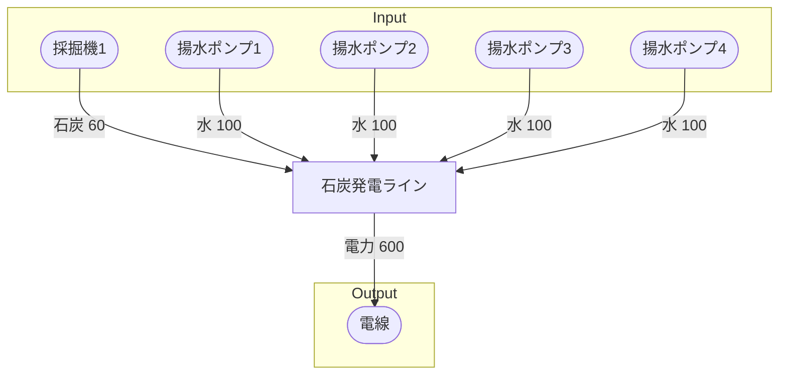

# 初期一時石炭発電所 全体製造ライン設計書

## 使用レシピ
### 石炭発電
|Input|Output|
|---|---|
|石炭 15/m|電力 75MW|
|水 50L/m||

## 必要製造ライン
### 石炭発電ライン
|レシピ名|数|Input計|Output計|
|---|---|---|---|
|石炭発電|8|石炭 120/m|電力 600MW|
|||水 400L/m||

## 製造ラインフローチャート

## 情報
書類テンプレートバージョン : 1.7.0
