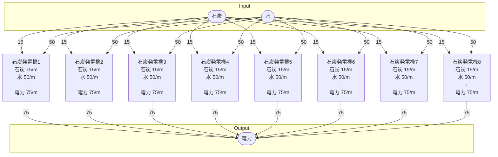

# 個別製造ライン設計書 電力製造ライン

## 概要
電力を製造するライン

## Input
- 石炭 120/m
- 水 400/m

## Output
- 電力 600/m

## 必要設備
- 石炭発電機 8ケ
- ベルトコンベア類 適量

## 製造ライン

```mermaid
flowchart TD

subgraph Input
    石炭([石炭])
    水([水])
end

石炭発電機1[
    石炭発電機1
    石炭 15/m
    水 50/m
    ↓
    電力 75/m
]

石炭発電機2[
    石炭発電機2
    石炭 15/m
    水 50/m
    ↓
    電力 75/m
]

石炭発電機3[
    石炭発電機3
    石炭 15/m
    水 50/m
    ↓
    電力 75/m
]

石炭発電機4[
    石炭発電機4
    石炭 15/m
    水 50/m
    ↓
    電力 75/m
]

石炭発電機5[
    石炭発電機5
    石炭 15/m
    水 50/m
    ↓
    電力 75/m
]

石炭発電機6[
    石炭発電機6
    石炭 15/m
    水 50/m
    ↓
    電力 75/m
]

石炭発電機7[
    石炭発電機7
    石炭 15/m
    水 50/m
    ↓
    電力 75/m
]

石炭発電機8[
    石炭発電機8
    石炭 15/m
    水 50/m
    ↓
    電力 75/m
]

subgraph Output
    電力([電力])
end

石炭-->|15|石炭発電機1
水-->|50|石炭発電機1
石炭発電機1-->|75|電力
石炭-->|15|石炭発電機2
水-->|50|石炭発電機2
石炭発電機2-->|75|電力
石炭-->|15|石炭発電機3
水-->|50|石炭発電機3
石炭発電機3-->|75|電力
石炭-->|15|石炭発電機4
水-->|50|石炭発電機4
石炭発電機4-->|75|電力
石炭-->|15|石炭発電機5
水-->|50|石炭発電機5
石炭発電機5-->|75|電力
石炭-->|15|石炭発電機6
水-->|50|石炭発電機6
石炭発電機6-->|75|電力
石炭-->|15|石炭発電機7
水-->|50|石炭発電機7
石炭発電機7-->|75|電力
石炭-->|15|石炭発電機8
水-->|50|石炭発電機8
石炭発電機8-->|75|電力
```

## 情報
書類テンプレートバージョン : 1.5.0
