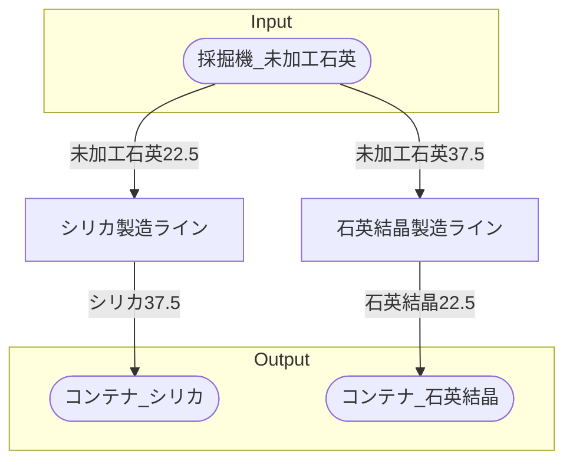

# 初期一時石英工場 全体製造ライン設計書

## 使用レシピ

### シリカ
|I/O|物品名|要求数|
|---|---|---|
|input|未加工石英|22.5|
|---|---|---|
|output|シリカ|37.5|
### 石英結晶
|I/O|物品名|要求数|
|---|---|---|
|input|未加工石英|37.5|
|---|---|---|
|output|石英結晶|22.5|

## 必要製造ライン
### シリカ製造ライン

レシピ名 : シリカ  
レシピ数 : 1

|I/O|物品名|要求数|
|---|---|---|
|input|未加工石英|22.5|
|---|---|---|
|output|シリカ|37.5|

### 石英結晶製造ライン

レシピ名 : 石英結晶  
レシピ数 : 1

|I/O|物品名|要求数|
|---|---|---|
|input|未加工石英|37.5|
|---|---|---|
|output|石英結晶|22.5|

## 製造ラインフローチャート

## 情報
書類テンプレートバージョン : 1.7.0
