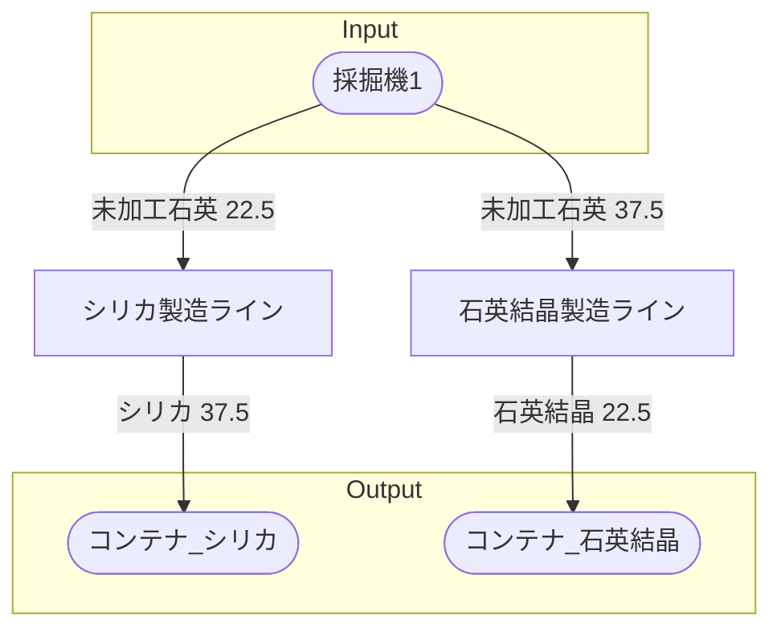

# 初期一時石英工場 全体製造ライン設計書

## 使用レシピ
### シリカ
|Input|Output|
|---|---|
|未加工石英 22.5/m|シリカ 37.5/m|
### 石英結晶
|Input|Output|
|---|---|
|未加工石英 37.5/m|石英結晶 22.5/m|

## 必要製造ライン
### シリカ製造ライン
|レシピ名|数|Input計|Output計|
|---|---|---|---|
|シリカ|1|未加工石英 22.5/m|シリカ 37.5/m|
### 石英結晶製造ライン
|レシピ名|数|Input計|Output計|
|---|---|---|---|
|石英結晶|1|未加工石英 37.5/m|石英結晶 22.5/m|

## 製造ラインフローチャート

## 情報
書類テンプレートバージョン : 1.7.0
