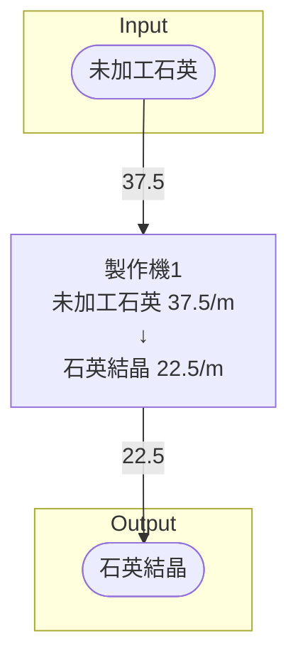

# 個別製造ライン設計書 石英結晶製造ライン

## 概要
以下の物品を生産する

- 石英結晶

## Input
- 未加工石英 37.5/m

## Output
- 石英結晶 22.5/m

## 必要設備
- 製作機 1ケ
- ベルトコンベア類 適量

## 製造ライン

```mermaid
flowchart TD

subgraph Input
    未加工石英([未加工石英])
end

製作機1[
    製作機1
    未加工石英 37.5/m
    ↓
    石英結晶 22.5/m
]

subgraph Output
    石英結晶([石英結晶])
end

未加工石英-->|37.5|製作機1
製作機1-->|22.5|石英結晶
```

## 情報
書類テンプレートバージョン : 1.5.0
