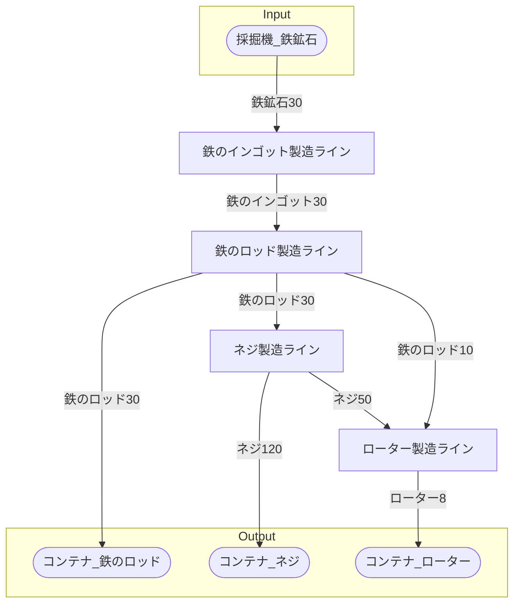

# 初期一時鉄のロッド工場 全体製造ライン設計書

## 使用レシピ

### 鉄のインゴット
|I/O|物品名|要求数|
|---|---|---|
|input|鉄鉱石|30|
|---|---|---|
|output|鉄のインゴット|30|
### 鉄のロッド
|I/O|物品名|要求数|
|---|---|---|
|input|鉄のインゴット|15|
|---|---|---|
|output|鉄のロッド|15|
### ネジ
|I/O|物品名|要求数|
|---|---|---|
|input|鉄のロッド|10|
|---|---|---|
|output|ネジ|40|
### ローター
|I/O|物品名|要求数|
|---|---|---|
|input|鉄のロッド|5|
|input|ネジ|25|
|---|---|---|
|output|ローター|4|

## 必要製造ライン
### 鉄のインゴット製造ライン

レシピ名 : 鉄のインゴット  
レシピ数 : 1

|I/O|物品名|要求数|
|---|---|---|
|input|鉄鉱石|30|
|---|---|---|
|output|鉄のインゴット|30|

### 鉄のロッド製造ライン

レシピ名 : 鉄のロッド  
レシピ数 : 2

|I/O|物品名|要求数|
|---|---|---|
|input|鉄のインゴット|30|
|---|---|---|
|output|鉄のロッド|30|

### ネジ製造ライン

レシピ名 : ネジ  
レシピ数 : 3

|I/O|物品名|要求数|
|---|---|---|
|input|鉄のロッド|30|
|---|---|---|
|output|ネジ|120|

### ローター製造ライン

レシピ名 : ローター  
レシピ数 : 2

|I/O|物品名|要求数|
|---|---|---|
|input|鉄のロッド|10|
|input|ネジ|50|
|---|---|---|
|output|ローター|8|

## 製造ラインフローチャート

## 情報
書類テンプレートバージョン : 1.7.0
