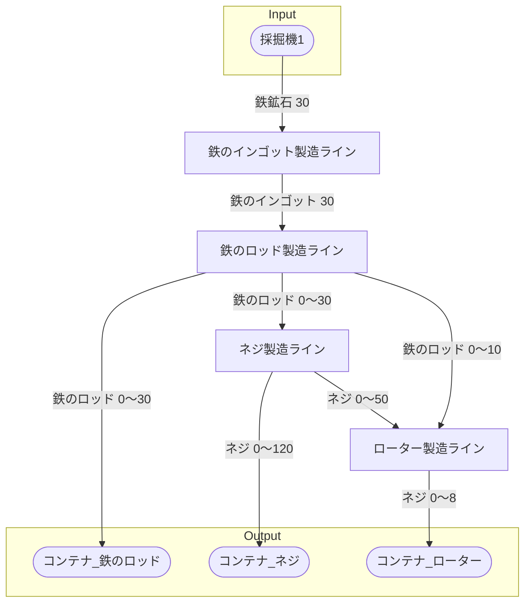

# 初期一時鉄のロッド工場 全体製造ライン設計書

## 使用レシピ
### 鉄のインゴット
|Input|Output|
|---|---|
|鉄鉱石 30/m|鉄のインゴット 30/m|
### 鉄のロッド
|Input|Output|
|---|---|
|鉄のインゴット 15/m|鉄のロッド 15/m|
### ネジ
|Input|Output|
|---|---|
|鉄のロッド 10/m|ネジ 40/m|
### ローター
|Input|Output|
|---|---|
|鉄のロッド 5/m|ネジ 25/m|

## 必要製造ライン
### 鉄のインゴット製造ライン
|レシピ名|数|Input計|Output計|
|---|---|---|---|
|鉄のインゴット|1|鉄鉱石 30/m|鉄のインゴット 30/m|
### 鉄のロッド製造ライン
|レシピ名|数|Input計|Output計|
|---|---|---|---|
|鉄のロッド|2|鉄のインゴット 30/m|鉄のロッド 30/m|
### ネジ
|レシピ名|数|Input計|Output計|
|---|---|---|---|
|ネジ|3|鉄のロッド 30/m|ネジ 120/m|
### ローター
|レシピ名|数|Input計|Output計|
|---|---|---|---|
|ローター|2|鉄のロッド 10/m|ネジ 50/m|

## 製造ラインフローチャート

## 情報
書類テンプレートバージョン : 1.8.0
