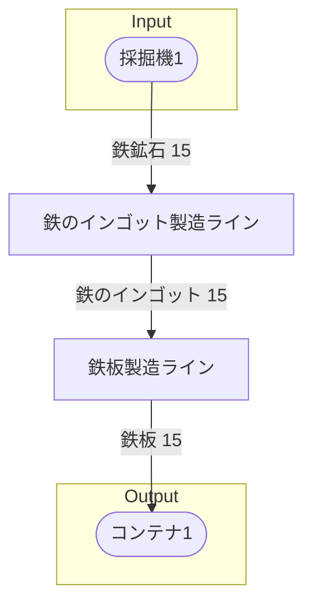

# 初期一時鉄のロッド工場 全体製造ライン設計書

## 使用レシピ
### 鉄のインゴット
|Input|Output|
|---|---|
|鉄鉱石 30/m|鉄のインゴット 30/m|
### 鉄板
|Input|Output|
|---|---|
|鉄のロッド 15/m|鉄板 15/m|

## 必要製造ライン
### 鉄のインゴット製造ライン
|レシピ名|数|Input計|Output計|
|---|---|---|---|
|鉄のインゴット|1|鉄鉱石 30/m|鉄のインゴット 30/m|
### 鉄のロッド製造ライン
|レシピ名|数|Input計|Output計|
|---|---|---|---|
|鉄のロッド|1|鉄のインゴット 15/m|鉄のロッド 15/m|

## 製造ラインフローチャート

## 情報
書類テンプレートバージョン : 1.7.0
