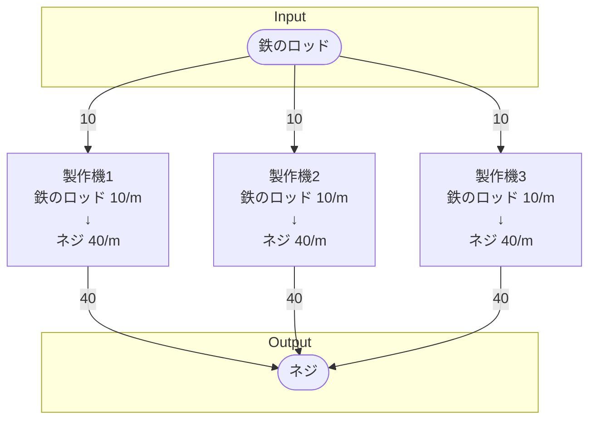

# 個別製造ライン設計書 ネジ製造ライン

## 概要
以下の物品を生産する

- ネジ

## Input
- 鉄のロッド 30/m

## Output
- ネジ 120/m

## 必要設備
- 製作機 3ケ
- ベルトコンベア類 適量

## 製造ライン

```mermaid
flowchart TD

subgraph Input
    鉄のロッド([鉄のロッド])
end

製作機1[
    製作機1
    鉄のロッド 10/m
    ↓
    ネジ 40/m
]

製作機2[
    製作機2
    鉄のロッド 10/m
    ↓
    ネジ 40/m
]

製作機3[
    製作機3
    鉄のロッド 10/m
    ↓
    ネジ 40/m
]

subgraph Output
    ネジ([ネジ])
end

鉄のロッド-->|10|製作機1
製作機1-->|40|ネジ
鉄のロッド-->|10|製作機2
製作機2-->|40|ネジ
鉄のロッド-->|10|製作機3
製作機3-->|40|ネジ
```

## 情報
書類テンプレートバージョン : 1.5.0
